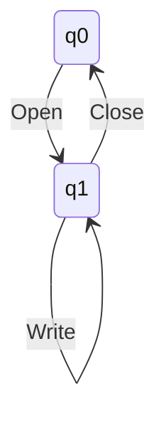

# Languages and Operations

- A language is a set of words
- A word is a sequence of symbols (from some alphabet)
- Most languages are infinite sets, hence we need appropriate notations

Example: The language of a correct file system:
- The alphabet consists of {`open`, `read`, `write`, `close`}

In regular expression: (open . (read + write)* . close)*

In finite automaton,

Typical questions on languages
1. Can every language be expressed by a regular expression (RE) or a finite automaton (FA)?
2. Is there a universal formalism to express more complex languages?
3. Can we transform RE to FA (and vice versa) systematically?
4. How to check that 2 REs (or FAs) are the same language?
5. What are useful operations to combine languages?

## Formal Definitions

1. Symbols: An alphabet of atomic letters
2. Words: A sequence of symbols
3. Language: A set of words

Given an alphabet $\Sigma$, $\Sigma^*$ is the set of all words in the form $a_1 \cdots a_n$ such that $\forall \ 1 \le i \le n, a_i \in \Sigma$. A language $L$ is a set of words $L \subseteq \Sigma^*$, or $L \in 2^{\Sigma^*}$

## Operations on Words

The recusrive definition of $\Sigma^*$:
1. $\Lambda$ is the empty word, which is in $\Sigma$
2. If $a \in \Sigma$ and $w$ is already a word, then $aw$ is also a word
3. All words can be obtained by applying (1) and (2)

Given 2 words $u$ and $v$, $uv$ is the concatenation of the 2 words

Given a word $u$, $u^n$ is the word repeated $n$ times
- $u^0 = \Lambda$
- $u^m u^n = u^{m + n}$, $(u^{m})^n = u^{mn}$

Given a word $u$, $u^r$ is the reverse of the word
- $(uv)^r = v^r u^r$ and $(u^r)^r = u$

Let $a, \sigma \in \Sigma$ and $u \in \Sigma^*$, define with recursion:
- Length: $|\Lambda| = 0, |au| = 1 + |u|$
- Count symbols: 

$$
\sigma = \begin{cases}
    n_\sigma(\Lambda) = 0 \\
    n_\sigma(au) = 1 + n_\sigma(u), \ \sigma = a \\
    n_\sigma(au) = n_\sigma(u), \ \sigma \neq a
\end{cases}
$$

We can use set notation to define languages:

- $L_1 = \{w \in \sigma^* \ | \ n_a(w) > n_b(w)\}$ (words with more a's than b's)
- $L_2 = \{ w \in \Sigma^* \ | \ w = w^r \}$ (palindromes over $\Sigma$)

## Operations on Languages

- Empty language: $\empty$
- Singleton language: $\{w\}$ (for any $w \in \Sigma^*$)

Assume that $L, L_1, L_2 \in \Sigma^*$
- $L_1 \cup L_2$ (Union)
- $L_1 \cap L_2$ (Intersection)
- $L'$ (Complement)

Operations on words transfer to languages in a natural way:

- Reverse: $L^r = \{u^r \ | \ u \in L\}$
    $$
        \begin{cases}
            \Lambda^r = \Lambda \\
            (au)^r = u^ra
        \end{cases}
    $$
- Concatenation: $L_1 L_2 = \{uv \ | \ u \in L_1 \land v \in L_2 \}$
    - $L^2 = LL$, $aa$ for $a \in L$

For finite sets, we can bound the size of these sets:
- $|L_1 \cup L_2| \leq |L_1| + |L_2|$
- $|L_1 L_2| \leq |L_1||L_2|$

# Extra Notes

$$
\begin{aligned}
L^* &= \bigcup \{ L^k | k \in \N \} \\
L^+ &= LL^* \\
L^* &= \{\Lambda\} \cup L^+
\end{aligned}
$$

Note that $\empty^* = \{ \Lambda \}$ and $\empty^+ = \empty$