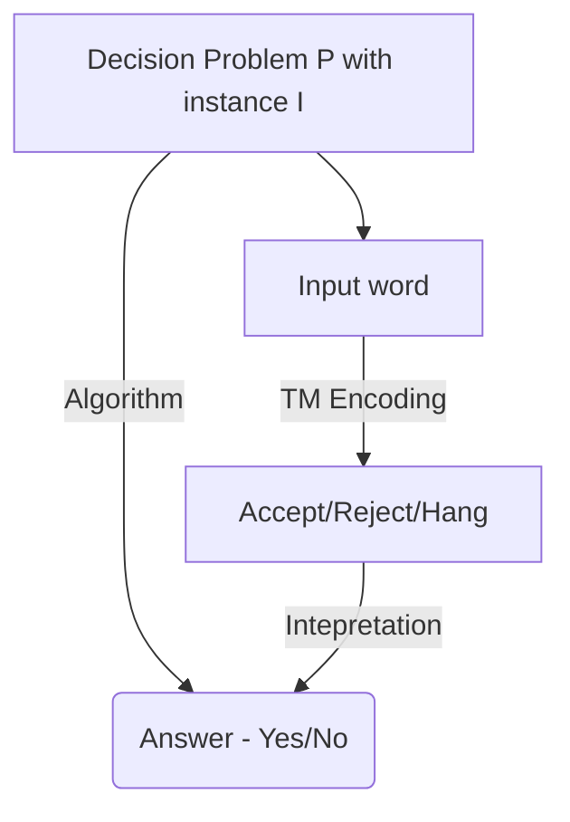

# Problem Reduction

Definition of decision problem:

A decision problem consists of

-   A definition of its inputs (set of instances)
-   A question that can be answered with yes/no

For example

-   Given $m \in \mathbb{N}$, is $m$ prime?
-   Given inputs TM $M$, does $M$ accept $e(M)$?

# Formalising Decision Problems with Turing Machines

-   Church Thesis postulates that every algorithm can be enoded into a Turing Machine

# Decidable Problems

A decision problem can be mapped into a formal language, which requires an encoding $e$ from instances $I$ to $\{0, 1\}^*$

Reasonable encoding $e$ for decision problem $P$

-   $e: I \to \{0, 1\}^*$ should be one-to-one (injective)
    -   Each unique input should have a unique encoding
-   The language $E(P) := \{ e(I) \ | \ I \text{ instance of } P\}$ should be recursive
    -   The set of all possible encodings should be recursive

Given an encoding $e$, we can partition

$$
\Sigma^* = E(P)' \uplus Y(P) \uplus N(P)
$$

-   $Y(P) = \{ e(I) \ | \ I \text{ a yes instance of } P \}$
-   $N(P) = \{ e(I) \ | \ I \text{ a no instance of } P \}$
-   $E(P)' = \{ e(I) \ | \ I \text{ not a valid instance of } P \}$

Definition of a decidable problem:

-   A decision problem is decidable, if for some reasonable encoding $e$, the set $Y(P)$ of yes-instances is a recursive language
-   That is, there is a TM $M$ that decides all encoded instances

## Recall Decision Problems with Turing Machines

Self-accepting:

-   Input: TM $M$
-   Question: Does $M$ accept $e(M)$?
-   $Y(\text{Self-accepting}) = SA = \{ e(M) \ | \ M \text{ accepts } e(M) \}$
-   $N(\text{Self-accepting}) = NSA = \{ e(M) \ | \ M \text{ does not accept } e(M) \}$
-   $SA$ is not recursive, so self-accepting is undecidable

Note that $P'$, the complementary problem of $P$, inverts the yes- and no-instances

-   If $P$ is decidable, $P'$ is also decidable
-   Recall that $N(P) = E(P) \cap Y(P)'$, recursive languages are closed under $'$ and $\cap$

# Problem Reduction

Language $L_1$ is reducible to $L_2$:

Let languages $L_1 \subseteq \Sigma_1^*$ and $L_2 \subseteq \Sigma_2^*$ be given.

$L_1 \leq L_2$ iff there is a computable function $f: \Sigma_1^* \to \Sigma_2^*$ such that $\forall x \in \Sigma_1^*: (x \in L_1 \iff f(x) \in L_2)$

-   All words in $\Sigma_1^*$ can be mapped to another word in $\Sigma_2^*$

Problem $P_1$ is reducible to $P_2$:

$P_1 \leq P_2$ if there is an algorithm $F$ that

-   Maps an instance $I$ of $P_1$ to $F(I)$ in $P_2$
-   $I$ is a yes-instance of $P_1$ iff $F(I)$ is a yes-instance of $P_2$

Notation: $P_1 \leq P_2$ ($P_2$ is at least as hard as $P_1$)

-   $P_1$ can be solved, by translating its instances to $P_2$, and solving those instances
-   If $P_2$ instances can be solved, then $P_1$ instances can also be solved

## Using Problem Reduction (Positively/Negatively)

Positive usage for $L_1 \subseteq \Sigma_1^*, L_2 \subseteq \Sigma_2^*$

If $L_1 \leq L_2$, and $L_2$ is recursive, then $L_1$ is recursive

-   Let TM $M_2$ decide $L_2$. Let TM $M_3$ compute $f: \Sigma_1^* \to \Sigma_2^*$.
-   Then, $M_1 := M_3 \to M_2$ decides $L_1$, because $w \in L_1$ iff $f(w) \in L_2$
    -   Take a word from $\Sigma_1^*$, convert it into a word in $\Sigma_2^*$ (using $M_3$), and check whether this word is in $L_2$ (using $M_2$)
    -   Since $L_1 \leq L_2$, $f(w) \in L_2 \iff w \in L_1$. If $M_2$ accepts $f(w)$, then $f(w) \in L_2$, then $w \in L_1$

Consequence: If $P_1 \leq P_2$ and $P_2$ is decidable, then $P_1$ is decidable.

-   For each instance $I$ of $P_1$, convert it into an instance $F(I)$ for $P_2$, solve $P_2$ with instance $F(I)$

Negative usage:

If $P_1 \leq P_2$ and $P_1$ is undecidable, then $P_2$ is undecidable

For example: $\text{Self-accepting} \leq \text{Accepts} \leq \text{Halts}$

-   Self-accepting: Input TM $M$, does $M$ accept $e(M)$?
-   Accepts: Input TM $M$ and word $w$, does $M$ accept $w$?
-   Halts: Input TM $M$ and word $w$, does $M$ halt on $w$?

Firstly, $\text{Self-accepting} \leq \text{Accepts}$

-   Self-accepting instance TM $M_1$
-   $F(M_1) := (M_1, e(M_1))$
-   Accepts instance TM $M_2$, $w \in \{0, 1\}^*$

$M_1$ is self-accepting iff $M_1$ accepts $e(M_1)$

Next, $\text{Accepts} \leq \text{Halts}$

-   Accepts instance $M_1$, $w \in \{0, 1\}^*$
-   Find some computable $F$?
    -   Requirement on $F$: $F(M_1, w_1) := F(M_2, w_2)$ such that $M_1 \text{ accepts } w_1 \iff M_2 \text{ accepts } w_2$
-   Halts instance $M_2$, $w_2 \in \{0, 1\}^*$

# Language Properties of Turing Machines

A property $R$ on TMs is a language property, if for any TM $M_1$ and $M_2$

$$
\mathcal{L}(M_1) = \mathcal{L}(M_2) \implies (R(M_1) \iff R(M_2))
$$

-   If the property holds on $M_1$, the property must also hold on $M_2$
-   If the property does not hold on $M_1$, the property must also not hold on $M_2$
-   This shows that $R$ is based on the language, and not on the TM itself

$R$ is non-trivial if for some TMs $M_1$ and $M_2$, it holds that $R(M_1)$ and $\neg R(M_2)$

-   Find some turing machine that satisfies $R(M_1)$
-   Find some other turing machine that satisfies $\neg R(M_2)$

## Rice's Theorem

> **Every** non-trivial language property of Turing Machines is undecidable

Proof1:

Let $P$ be an arbitrary non-trivial property. Suppose that $P$ was decidable (for sake of contradiction)

We build a decider for $Accepts$:

-   $<M, w>$, where $M$ is a TM, and $w$ is some word
-   Check if $M$ accepts $w$

On input $M, w$

1. Construct TM $M'$
    - Goal: $M$ accepts $w$ iff $M' \in P$
    - $M$ will accept $w$ if $M'$ has property $P$
    - $M'$: On input $x$:
        - Simulate $M$ on $w$. If $M$ rejects $w$, $M'$ rejects $x$
        - Run $T$ on $x$, and $M'$ accept $x$ if $T$ accepts
            - $T$ is some TM that has property $P$. We can assume this because $P$ is non-trivial (Note for non-triviality: if there exists a TM $M$ that has property $P$, then there exists another TM $M'$ that does not have property $P$)
        - If $M$ accepts $w$ then $\mathcal{L}(M') = \mathcal{L}(T)$, which means $M' \in P$
        - If $M$ does not accept $w$, $\mathcal{L}(M') = \emptyset$, which means $M' \not \in P$
2. Let $D$ be a decider for $P$
    - This is a valid assumption since we assumed above that $P$ is decidable
    - We now run $D$ on $M'$
    - If $D$ accepts, accept. Otherwise, reject

But $Accepts$ is undecidable, hence $P$ is undecidable, because no decider for it can exist

Proof2:

Let $R$ be some non-trivial language property. We show either Accepts-$\Lambda \leq R$ or Accepts-$\Lambda \leq R'$ (But we do not know which one). Note that in both cases, $R$ is undecidable

$R$ is non-trivial, so there exists $M_1$ and $M_2$ with $R(M_1)$ and $R'(M_2)$

Let $M$ be an arbitrary instance of Accepts-$\Lambda$. Define (for i=1,2)

$$
F_i(M) := NB \to Write(\$) \to M \to Erase(\$) \to PB \to M_i
$$

-   Execute $M$ on some empty spot
-   Then run $M_i$ on the original input

If $M$ accepts $\Lambda$, then $\mathcal{L}(F(M_i)) = \mathcal{L}(M_i)$ and $R$ is a language property:

-   $F_1(M)$ has property $R$
-   $F_2(M)$ has property $R'$

If $M$ does not accept $\Lambda$, then $\mathcal{L}(F_1(M_i)) = \mathcal{L}(F_2(M_i)) = \emptyset = \mathcal{L}(M_\emptyset)$

-   Case 1: $R(M_\emptyset)$, so $R(F_2(M))$, then $M$ accepts $\Lambda$ $\iff R'(F_2(M))$. Hence Accept-$\Lambda \leq R'$ by reduction of $F_2$
-   Case 2: $R'(M_\emptyset)$, so $R'(F_1(M))$, then $M$ accepts $\Lambda$ $\iff R(F_1(M))$. Hence Accept-$\Lambda \leq R$ by reduction of $F_1$

# Resources

-   https://www.youtube.com/watch?v=jIAEpYwJgbA
