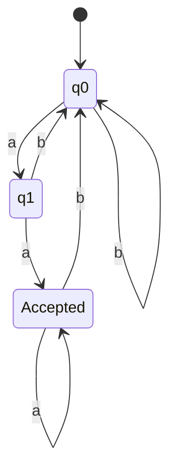
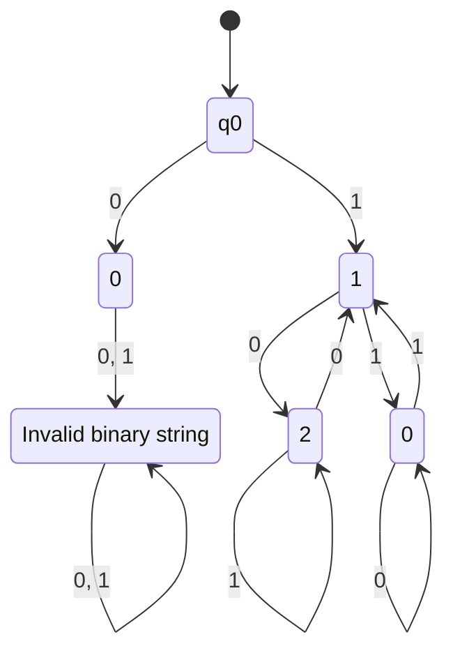

# Finite Automata

A finite automaton is a model of a particularly simple computing device

Finite automatons receive an input string, and outputs an answer (either a yes/no)

- These are called **Language Acceptors**
- Answer can be independent of the input string
- Answer can be dependent only on the last received character (current state)

Consider the finite automaton that accepts all words that end with "aa"

$$
L_1 = \{ x \in \{a, b \}^* \ | \ \text{$x$ ends with $aa$} \}
$$

Here is a finite automaton that accepts all binary representations of integers divisible by 3:

$$
L_2 = \{ x \in \{ 0, 1 \}^* \ | \ x \mod 3 = 0 \}
$$

Consider a number $x$.

- When we add a 0 behind, it is the same as multiplying by 2.
- When we add a 1 behind, it is the same as multiplying by 2, then adding 1.
- We do not want $x$ to have leading zeroes (other than for 0 itself)

We only accept states "0" (representing 0 remainder)

Finite automatons are useful in lexical analysis

- Ensuring that a sequence of tokens is valid, such as `main() { double b = 41.3; b *= 4; ... }`

## Formal definition of Finite Automaton

A finite automaton (FA) is a 5-tuple $M = (Q, \Sigma, q_0, A, \delta)$ where

- $Q$ is a finite set of states
- $\Sigma$ is a finite input alphabet
- $q_0 \in Q$ is the initial state
- $A \subseteq Q$ is the set of accepting states
- $\delta: Q \times \Sigma \rightarrow Q$ is the transition function

For any element $q \in Q$ and any symbol $\sigma \in \Sigma$, we intepret $\delta(q, \sigma)$ as the state which the FA moves to, if it is in state $q$ and receives input $sigma$

We now define the extended transition function $\delta^*: Q \times \Sigma^* \rightarrow Q$

$\delta^*(q, x)$ represents the state the FA ends up in if it starts at state $q$ and receives a string $x$.

### The Extended Transition Function $\delta^*$

Let $M = (Q, \Sigma, q_0, A, \delta)$ be a FA. We define the transition function

$$
\delta^*: Q \times \Sigma^* \rightarrow Q
$$

as follows:

1. For every $q \in Q$, $\delta^*(q, \Lambda) = q$
2. For every $q \in Q$, $y \in \Sigma^*$, $\sigma \in \Sigma$,
   $$
   \delta^*(q, y\sigma) = \delta(\delta^*(q, y), \sigma)
   $$

A natural generalisation of the recursion is that

$$
\forall x, y \in \Sigma^*, q \in Q \\
\delta^*(q, xy) = \delta^*(\delta^*(q, x), y)
$$

### Acceptance in FA

Let $M = (Q, \Sigma, q_0, A, \delta)$ be a FA, and let $x \in \Sigma^*$. The string $x$ is accepted by $M$ if

$$
\delta^*(q_0, x) \in A
$$

Otherwise, it is rejected by M. The language accepted by $M$ is the set

$$
\begin{aligned}
L(M) &= \{ x \in \Sigma^* \ | \ \text{$x$ is accepted by $M$} \} \\
&= \{ x \in \Sigma^* \ | \ \delta^*(q_0, x) \in A \}
\end{aligned}
$$

A language $L$ over $\Sigma$ is accepted by $M$ iff $L = L(M)$

# Accepting the Union, Intersection and Difference of 2 Languages

Suppose $L_1$ and $L_2$ are languages over $\Sigma$. We will now show that if there are FAs that accept $L_1$ and $L_2$, we can easily formulate another FA that accepts $L_1 \cup L_2$, $L_1 \cap L_2$ or $L_1 - L_2$

## Theorem

Suppose $M_1 = (Q_1, \Sigma, q_1, A_1, \delta_1)$ and $M_2 = (Q_2, \Sigma, q_2, A_2, \delta_2)$ are FAs accepting $L_1$ and $L_2$ respectively. Let $M = (Q, \Sigma, q_0, A, \delta)$ such that:

$$
Q = Q_1 \times Q_2 \\
q_0 = (q_1, q_2)
$$

And the transition function

$$
\delta((p, q), \sigma) = (\delta_1(p, \sigma), \delta_2(q, \sigma))
$$

for every $p \in Q_1$ and $q \in Q_2$, and every $\sigma \in \Sigma$. Then

1. If $A = \{ (p, q) \ | \ p \in A_1 \lor q \in A_2 \}$, then $M$ accepts $L_1 \cup L_2$
2. If $A = \{ (p, q) \ | \ p \in A_1 \land q \in A_2 \}$, then $M$ accepts $L_1 \cap L_2$
3. If $A = \{ (p, q) \ | \ p \in A_1 \land q \not \in A_2 \}$, then $M$ accepts $L_1 - L_2$

We consider statement 1, and the other two are similar. The way the transition function $\delta$ is defined allows us to say that at any point during the operation of $M$, if $(p,q)$ is the current state, then $p$ and $q$ are the current states of $M_1$ and $M_2$, respectively. This will follow immediately
from the formula

$$
\delta^*(q_0, x) = (\delta^*(q_1, x), \delta^*(q_2, x))
$$

which is true for every $x \in \Sigma^*$ (Proof left as an exercise)

For every string $x \in \Sigma^*$, $x$ is accepted by $M$ if $\delta^*(q_0, x) \in A$, and according to the definition of $A$ and the formula for $\delta^*$, this is true if $\delta^*(q_1, x) \in A_1$ or $\delta^*(q_2, x) \in A_2$, which means $x \in L_1 \cup L_2$

# Completion of Incomplete DFA

Given an incomplete DFA $M = (Q, \Sigma, q_0, A, \delta)$, we can construct a complete DFA $M' = (Q \cup \{ q_e \}, \Sigma, q_0, A, \delta')$ where:

- $q_e$ is a **trap state**
- $\delta'(q, a) = \delta(q, a)$ if $q \in Q$ and $\delta(q, a)$ is defined
- $\delta'(q, a) = q_e$ if $q \in Q$ and $\delta(q, a)$ is not defined
- $\delta'(q_e, a) = q_e$

# Complement of a DFA

Given a complete DFA $M = (Q, \Sigma, q_0, A, \delta)$, we can construct the complement $M'$:

$$
M' = (Q, \Sigma, q_0, Q - A, \delta)
$$

The language accepted by $M'$ is $L(M') = \Sigma^* - L(M) = L(M)'$

Note that the complete does not work for an incomplete DFA
