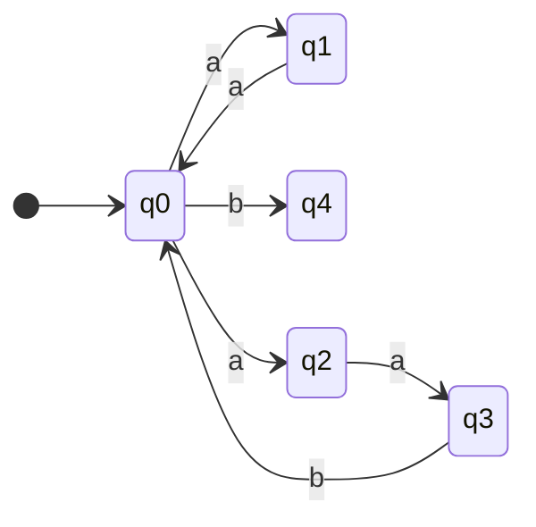

# Regular Expressions, Nondeterminism, and Kleene’s Theorem

## Regular Expressions

A **regular** language is a language that can be expressed by a formula involving

-   Union
-   Concatenation
-   Kleene \*

For example:

-   The language of strings ending with $aa$: $\{ a, b \}^* \{aa\}$
-   The language of strings containing the substring $ab$ or $bba$: $\{a, b\}^* (\{ ab \} \cup \{ bba \})\{a, b\}^*$

### Definition of a Regular Language over an Alphabet $\Sigma$

If $\Sigma$ is an alphabet, the set $R$ of regular languages over $\Sigma$ is defined as follows:

1. The language $\emptyset$ is an element of $R$, and for every $a \in \Sigma$, the language $\{ a\} \in R$
2. For any 2 languages $L_1$ and $L_2$ in $R$, the three languages $L_1 \cup L_2, L_1 L_2, L_1^*$ are elements of $R$

Note that the language $\{ \Lambda \}$ is a regular language over $\Sigma$ because $\emptyset^* = \{ \Lambda \}$

A regular language over $\Sigma$ has an explicit formula. A regular expression for a language is a more user-friendly formula.

In a regular expression

-   $()$ replace $\{\}$ and are omitted if rules of precedence allows
-   $\cup$ is replaced by $+$

| Regular Language                                    | Regular Expression                            |
| --------------------------------------------------- | --------------------------------------------- |
| $\emptyset$                                         | $\emptyset$                                   |
| $\{ \Lambda \}$                                     | $\Lambda$                                     |
| $\{a, b\}^∗$                                        | $(a + b)^∗$                                   |
| $\{aab\}^∗\{a, ab\}$                                | $(aab)^∗(a + ab)$                             |
| $(\{aa, bb\} ∪ \{ab, ba\}\{aa, bb\}^∗\{ab, ba\})^∗$ | $(aa + bb + (ab + ba)(aa + bb)^∗(ab + ba))^∗$ |

A single language can be expressed by multiple unique regular expressions. For example, the language of strings in $\{ a, b \}^*$ with an odd number of $a$'s:

-   $b^* a b^* (a b^* a b^*)^*$
-   $b^* a (b^* a b^* a)^* b^*$
-   etc

## Definition of a Regular Expression

Regular expressions are defined inductively:

-   Basis: $\empty, \Lambda$ and $a$ (for $a \in \Sigma$) are regular expressions
-   If $E_1$ and $E_2$ are regular expressions, then

    -   $E_1 E_2$
    -   $(E_1 + E_2)$
    -   $E_1^*$

    are regular expressions

-   There exist no other regular expressions

For each regular expression $E$, $L(E)$ is the language accepted by $E$

2 regular expressions are equivalent iff they define the same language

$$
E_1 = E_2 \iff L(E_1) = L(E_2)
$$

| $E$         | $\mathcal{L}(E)$     |
| ----------- | -------------------- |
| $\empty$    | $\empty$             |
| $\Lambda$   | $\{ \Lambda \}$      |
| $a$         | $\{ a \}$            |
| $E_1 + E_2$ | $L(E_1) \cup L(E_2)$ |
| $E_1 E_2$   | $L(E_1) L(E_2)$      |
| $E^*$       | $L(E)^*$             |

## Constructing Regular Expressions

For all examples, $\Sigma = \{ a, b, c \}$

1. Start with $ab$, end with $ba$

    $(aba) + (ab (a + b + c)^* ba)$

2. All words with an even number of $a$'s

    $(b+c)^*(a(b+c)^*a)^*(b+c)^*$

## Induction over RE

Let $P(E)$ be a property of the regular expression $E$. If we want to prove $P$ using induction:

-   Base case: $\emptyset, \Lambda, a (a \in \Sigma)$
-   For all $E_1, E_2 \in RE$, if $P(E_1)$ and $P(E_2)$, then $P(E_1 + E_2)$
-   For all $E_1, E_2 \in RE$, if $P(E_1)$ and $P(E_2)$, then $P(E_1 E_2)$
-   For all $E \in RE$, if $P(E)$ then $P(E^*)$

Then, $\forall E \in RE, P(E)$

## Nondeterministic Finite Automata

We want to prove that regular languages are precisely the languages accepted by finite automata. To do this, we will use a more general device, called the **nondeterministic finite automata**.

Example: Accepting the language: $\{ aa, aab\}^*\{b\}$

$q4$ is the accepted state. Note that this is not a normal finite automata, because

-   There are more than 2 transitions from $q_0$
-   There are less than 2 transitions for some other states as well

Input strings (such as aaaabaab) can allow us to reach the accepting stage, but at the same time it can also follow other paths that do not lead to the accepting stage.

It is "nondeterministic" in a sense that the path it follows is not determined by the input string.

-   Suppose we watch this NFA process a string $x$. If it reaches the accepting state, we know for sure $x \in L$. However, if it does not, we can only say that the moves it chose did not lead it to the accepting state (possible that $x \in L$, but we chose the wrong path)

Allowing non-determinism allows us to easily draw diagrams corresponding to regular expressions.

We can visualize all possible paths using a **computation tree**

-   The level of the tree corresponds to the prefix of the input that is already traversed, and each node represents the possible state that the device "could be" in depending on the choices made.
-   Basically a Depth-First Search (DFS) through the whole NFA using the input string.

### Formal Definition of an NFA

A nondeterministic finite automata (NFA) is a 5-tuple $M = (Q, \Sigma, q_0, A, \delta)$ where

-   $Q$ is a finite set of states
-   $\Sigma$ is a finite input alphabet
-   $q_0 \in Q$ is the initial state
-   $A \subseteq Q$ is the set of accepting states
-   $\delta: Q \times (\Sigma \cup \{ \Lambda \}) \rightarrow 2^Q$ is the transition function

For every element $q \in Q$ and every element $\sigma \in \Sigma \cup \{ \Lambda \}$, we interpret $\delta(q, \sigma)$ as the set of states to which the FA can move, if it is in state $q$ and receives the input $\sigma$, or if $\sigma = \Lambda$, the set of states other than $q$ to which the NFA can move to from state $q$ without receiving any input symbol.

We also define a $\delta^*(q, x)$ to tell us all the states that $M$ can get to starting at $q$ with input string $x$

$\delta^*$ can be defined recursively, however if $M$ contains some $\Lambda$-transitions, we need to be more precise.

To define $\delta^*(q, x\sigma)$ where $x \in \Sigma^*$ and $\sigma \in \Sigma$, we start by considering $\delta^*(q, x\sigma)$ to be an ordinary FA. This is now a _set_ of states, and for each state $p$ in this set, $\delta(p, \sigma)$ is also a set. To include all possibilities, we consider

$$
\bigcup \{ \delta(p, a) \ | \ p \in \delta^*(q, x) \}
$$

We must also keep in mind of $\Lambda$-transitions. In the recursive step for $\delta^*$, we must consider all additional states that can be reached from elements of the union, using nothing but $\Lambda$-transitions

Suppose $M = (Q, \Sigma, q_0, A, \delta)$ be an NFA and $S \subseteq Q$ is a set of states. The $\Lambda$-closure of $S$ is the set $\Lambda(S)$ that can be defined recursively:

1. $S \subseteq \Lambda(S)$
2. For every $q \in \Lambda(S), \delta(q, \Lambda) \subseteq \Lambda(S)$

### The Extended Transition Function $\delta^*$ for an NFA, and the Definition of Acceptance

Let $M = (Q, \Sigma, q_0, A, \delta)$ be an NFA. We define the extended transition function

$$
\delta^*: Q \times \Sigma^* \rightarrow 2^Q
$$

as follows:

1. For every $q \in Q, \delta^*(q, \Lambda) = \Lambda(\{q \})$
2. For every $q \in Q$, every $y \in \Sigma^*$ and every $\sigma \in \Sigma$:

    $$
    \delta^*(q, y\sigma) = \Lambda \left( \bigcup \{ \delta(p, \sigma) \ | \ p \in \delta^*(q, y) \} \right)
    $$

## Non-determinism in an NFA can be Eliminated

We can see that non-determinism arises from 2 cases

1. If there is a state $q$ and an alphabet $\sigma$ such that there are several different transitions possible in state $q$ with symbol $\sigma$
2. $\Lambda$-transitions, where the NFA can transition on an input symbol or no input at all

Both types of nondeterminism can be eliminated. For (2) we can introduce new transitions such that we do not need $\Lambda$-transitions.

-   In every case where there is no $\sigma$-transition from $p$ to $q$, but the NFA can go from $p$ to $q$ using 1 or more $\Lambda$-transitions as well as $\sigma$, we will introduce a $\sigma$-transition
-   This may result in more non-determinism, but it will still be able to accept the same strings as before

### Theorem 1: Eliminating $\Lambda$-transitions

> For every language $L \subseteq \Sigma^*$ accepted by an NFA $M = (Q, \Sigma, q_0, A, \delta)$, there is an NFA $M_1$ with no $\Lambda$-transitions that also accepts $L$

Proof:

To eliminate $\Lambda$-transitions, we may need to add additional transitions to ensure the same strings are accepted.

In addition, If $q_0 \not \in A$, but $\Lambda \in L$ (The empty string is an acceptable word), then we must ensure that $q_0$ is an accepting state for $M_1$, to guarantee that $M_1$ accepts $\Lambda$

Define:

$$
M_1 = (Q, \Sigma, q_0, A_1, \delta_1)
$$

where for every $q \in Q$, $\delta_1(q, \Lambda) = \emptyset$ and for every $q \in Q$ and every $\sigma \in \Sigma$,

$$
\delta_1(q, \sigma) = \delta^*(q, \sigma)
$$

Finally, we define:

$$
A_1 = \begin{cases}
A \cup \{ q_0 \} & \text{if $\Lambda \in L$} \\
A & \text{otherwise}
\end{cases}
$$

Note that $\delta^*(q, x)$ is the set of all states $M$ can reach from $q$ using the symbols of $x$ and $\Lambda$-transitions.

We now sketch a proof that for every $q$ and every $x$ such that $|x| \geq 1$:

$$
\delta_1^*(q, x) = \delta^*(q, x)
$$

Proof is by structural induction on $x$.

If $x = a \in \Sigma$, then by definition of $\delta_1$, $\delta_1(q, x) = \delta^*(q, x)$. Since $M_1$ has no $\Lambda$-transitions, $\delta_1(q, x) = \delta_1^*(q, x)$

Suppose that for some $y$ with $|y| \geq 1$, $\delta_1^*(q, y) = \delta^*(q, y)$ for every state $q$, and let $\sigma$ be an arbitrary element of $\Sigma$

$$
\begin{aligned}
\delta_1^*(q, y \sigma) &= \bigcup \{ \delta_1(p, \sigma) \ | \ p \in \delta_1^*(q, y) \} \\
&= \bigcup \{ \delta_1(p, \sigma) \ | \ p \in \delta^*(q, y) \} & (\text{Induction}) \\
&= \bigcup \{ \delta^*(p, \sigma) \ | \ p \in \delta^*(q, y) \} & (\text{Definition of $\delta_1$}) \\
&= \delta^*(q, y\sigma)
\end{aligned}
$$

Note that the last step is a special case of the general formula:

$$
\delta^*(q, yz) = \bigcup \{ \delta^*(p, z) \ | \ p \in \delta^*(q, y) \}
$$

Now we can verify $L(M_1) = L(M) = L$. If the string $\Lambda$ is accepted by $M$, then it is accepted by $M_1$ because in this case, $q_0 \in A$ by definition. If $\Lambda \not \in L(M)$ then $A = A_1$; therefore $q_0 \not \in A_1$ and $\Lambda \not \in L(M_1)$

Suppose $|x| \geq 1$. If $x \in L(M)$, then $\delta^*(q, x)$ contains an element of $A$; therefore since $\delta^*(q_0, x) = \delta_1^*(q_0, x)$ and $A \subseteq A_1$, $x \in L(M_1)$

Now suppose $x \in L(M_1)$. Then $\delta_1^*(q_0, x)$ contains an element of $A_1$. The state $q_0 \in A_1$ only if $\Lambda \in L$; therefore if $\delta_1^*(q_0, x)$ contains $q_0$, it also contains every element of $A$ in $\Lambda(\{q_0\})$. In any case, if $x \in L(M_1)$ then $\delta_1^*(q_0, x)$ must contain an element of $A$, which implies that $x \in L(M)$

### Theorem 2: NFA -> FA

> For every language $L \subseteq \Sigma^*$ accepted by an NFA $M = (Q, \Sigma, q_0, A, \delta)$, there is an FA $M_1 = (Q_1, \Sigma, q_1, A_1, \delta_1)$ that also accepts $L$

Because of the previous theorem, it is sufficient to prove this theorem in the case where $M$ has no $\Lambda$-transitions.

The formulas for $\delta^*$ are simplified accordingly:

-   $\delta^*(q, \Lambda) = \{ q \}$
-   $\delta^*(q, x\sigma) = \bigcup \{ \delta(p, \sigma) \ | \ p \in \delta^*(q, x) \}$

The FA $M_1$ can be defined as follows using the _subset construction_: The states of $M_1$ are sets of states of $M$:

$$
Q_1 = 2^Q
$$

The initial state $q_1$ of $Q_1$ is $\{ q_0 \}$. For every $q \in Q_1$ and every $\sigma \in \Sigma$,

$$
\delta_1(q, \sigma) = \bigcup \{ \delta(p, \sigma) \ | \ p \in q \}
$$

and the accepting states of $M_1$ are defined as:

$$
A_1 = \{ q \in Q_1 \ | \ q \cap A \neq \emptyset \}
$$

The fact that both $M_1$ and $M$ accept the same language is based off the fact that

$$
\delta_1^*(q_1, x) = \delta^*(q_0, x)
$$

which we will prove by structural induction on $x$.

Base case: $x = \Lambda$

If $x = \Lambda$, then

$$
\begin{aligned}
\delta_1^*(q_1, x) &= \delta_1^*(q_1, \Lambda) \\
&= q_1 & (\text{Definition of $\delta_1^*$}) \\
&= \{ q_0 \} & (\text{By definition of $q_1$}) \\
&= \delta^*(q_0, \Lambda) & (\text{By definition of $\delta^*$}) \\
&= \delta^*(q_0, x)
\end{aligned}
$$

Induction hypothesis: $x$ is a string for which $\delta_1^*(q_1, x) = \delta^*(q_0, x)$.

We must now show that for every $\sigma \in \Sigma, \delta_1^*(q_1, x\sigma) = \delta^*(q_0, x\sigma)$

$$
\begin{aligned}
\delta_1^*(q_1, x\sigma) &= \delta_1(\delta_1^*(q_0, x), \sigma) & (\text{Definition of $\delta_1^*$}) \\
&= \delta_1(\delta^*(q_0, x), \sigma) & (\text{Induction}) \\
&= \bigcup \{ \delta(p, \sigma) \ | \ p \in \delta^*(q_0, x) \} & (\text{Definition of $\delta_1$}) \\
&= \delta^*(q_0, x\sigma) & (\text{Definition of $\delta^*$})
\end{aligned}
$$

A string $x$ is accepted by $M_1$ precisely if $\delta_1^*(q_1, x) \in A_1$. We know now this is true iff $\delta^*(q_0, x) \in A_1$, and according to the definition of $A_1$, this is true iff $\delta^*(q_0, x) \cap A \neq \emptyset$. Therefore $x$ is accepted by $M_1$ iff $x$ is accepted by $M$

# Resources

-   [JFLAP](https://www.jflap.org/)
-   [Intersection of 2 FA's](http://www.cs.um.edu.mt/gordon.pace/Research/Software/Relic/Transformations/FSA/intersection.html)
