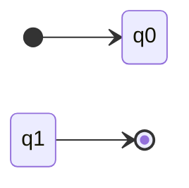
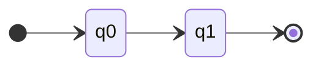
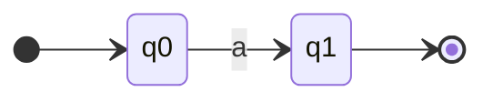
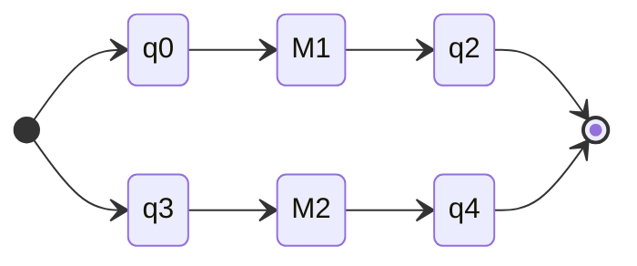
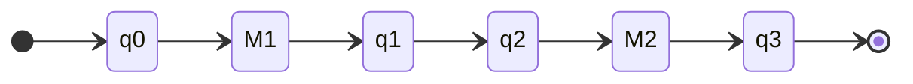
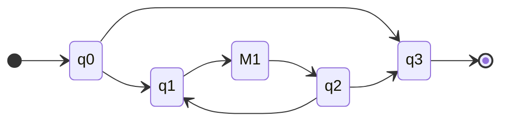
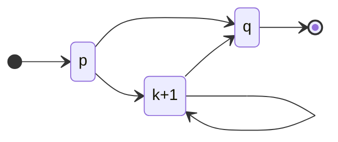

# Conversion between NFA, DFA, RE

Recall the definitions for NFA, DFA, RE

## Regular Expression

Regular expressions are defined inductively:

-   Basis: $\empty, \Lambda, a (a \in \Sigma)$ are regular expressions
-   If $E_1$ and $E_2$ are regular expressions, then $(E_1 + E_2)$, $E_1 E_2$, $E_1^*$ are regular expressions
-   There exist no other regular expressions

## Deterministic Finite Automata

A deterministic finite automata (DFA) is defined as $M = (Q, \Sigma, q_0, A, \delta)$

-   $Q$ is a set of states
-   $\Sigma$ is the set of symbols accepted by $M$
-   $q_0 \in Q$ is the initial state
-   $A \subseteq Q$ is the set of accepting states
-   $\delta: Q \times \Sigma \rightarrow Q$ is the transition function

## Non-deterministic Finite Automata

A non-deterministic finite automata (NFA) is defined as $M = (Q, \Sigma, q_0, A, \delta)$

-   $Q$ is a set of states
-   $\Sigma$ is the set of symbols accepted by $M$
-   $q_0 \in Q$ is the initial state
-   $A \subseteq Q$ is the set of accepting states
-   $\delta: Q \times (\Sigma \cup \{ \Lambda \}) \rightarrow 2^Q$ is the transition function

# Conversion of RE to NFA

Theorem: For every regular expression $E$, there exists an equivalent NFA $M$ such that $L(E) = L(M)$

We will prove this using structural induction over the regular expression $E$, we prove that there exists an equivalent composable NFA

A composable NFA has the following properties:

-   Initial state $q_0$ has in-degree of 0
-   There is a unique final state
-   Final state has out-degree of 0

Base case: $E = \emptyset$

$E = \Lambda$

$E = a, a \in \Sigma$

Induction step: Suppose we already have composable NFAs $M_1$ and $M_2$ for $E_1$ and $E_2$, with $L(M_1) = L(E_1)$ and $L(M_2) = L(E_2)$

We will now construct NFAs for $E_1 + E_2$, $E_1 E_2$ and $E_1^*$

$E = E_1 + E_2$

$E = E_1 E_2$

$E = E_1^*$

# NFA to DFA

Let NFA $M = (Q, \Sigma, q_0, A, \delta)$ be given.

For all NFA $M$, there exists a DFA $D$ such that $L(M) = L(D)$

Define the DFA

$$
D := \left( 2^Q, \Sigma, \Lambda(\{q_0\}), A', \Delta \right)
$$

-   $\Delta: 2^Q \times \Sigma \rightarrow 2^Q$

$$
\Delta(S, a) = \Lambda \left( \bigcup \left\{ \delta(q, a) \ | \ q \in S  \right\} \right)
$$

-   $A' = \{ S \in 2^Q \ | \ S \cap A \neq \empty \}$
    -   Every word $x$ can end up in multiple different states. As long as at least one of them is a final state, $x$ is accepted by $M$

However, converting from an NFA with $n$ states results in a DFA with $2^n$ states

To convert from NFA to DFA

1. Remove $\Lambda$-transitions
2. Eliminate non-determinism

-   [Example conversion](https://www.youtube.com/watch?v=i-fk9o46oVY)
-   [Example conversion 2](https://www.youtube.com/watch?v=4-N3GfHb134)

# NFA to RE

## Method 1: State Elimination

1. Ensure that there is only 1 final state (use additional $\Lambda$-transitions)
    - To ensure only 1 final state (assuming multiple are present), create a new final state $q_f$, and for each existing final state, draw a $\Lambda$-transition to $q_f$. Those existing final states are not final states anymore.
2. Eliminate non-initial and non-final states step-by-step
    - If there is a transition from $a_i$ to $a_j$ to $a_k$, we can remove $a_j$, and replace the transition with the appropriate regular expression
    - These are called "expression graphs"
    - If we are removing a node $a$, and the node has $m$ incoming edges, and $n$ outgoing edges, the number of new transitions we need will be $mn$
3. At the end, only the initial and final state are left. Read off the final expression

## Method 2: Dynamic Programming

Let $M = (Q, \Sigma, q_0, A, \delta)$ be an DFA. Assume that all the states are numbered $1$ to $|Q|$.

We introduce a new function $L: Q \times Q \rightarrow 2^{\Sigma^*}$. $L$ is the language from $p$ to $q$

$$
L(p, q) = \{ w \in \Sigma^* \ | \ \delta^*(p, w) = q \}
$$

Note that $L(M) = \bigcup \{ L(q_0, q) \ | \ q \in A \}$

Now, we introduce a new paramter $k$:

$$
L(p, q, k) = \{ w \in \Sigma^* \ | \ \delta^*(p, w) = q \text{ going through states$\leq k$ only} \}
$$

Note that $L(p, q) = L(p, q, |Q|)$

### Recursive Computation of $L(p, q, k)$

Base case: $L(p, q, 0)$

-   Start with $\empty$
-   Add $+a$ for each $\delta(p, a) = q$
-   Add a $+\Lambda$ if $p = q$

Inductive case: $L(p, q, k+1)$

-   Assume $L(p, q, k), L(p, k+1, k)$ exists
-   $L(k+1, k+1, k), L(k+1, q, k)$ exists

Then,

$$
L(p, q, k+1) = L(p, q, k) \cup \\ L(p, k + 1, k) L(k + 1, k + 1, k)^* L(k + 1, q, k)
$$

