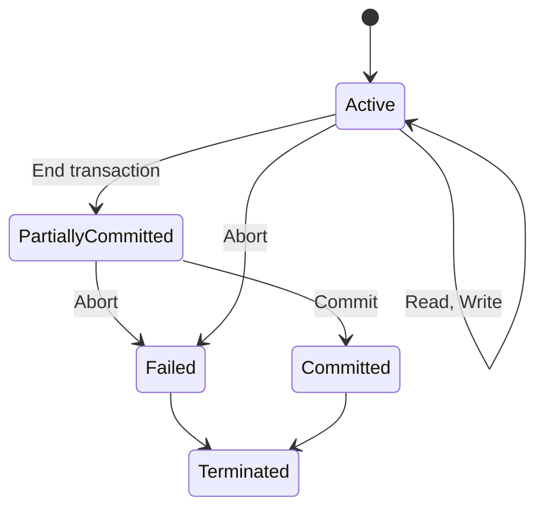

# Transactions

Single-User system

- At most 1 user at a time can use the system
- Slow but safe

Multi-User System

- Many users can access the system concurrently
- Fast, typical use case, need to handle interactions

Concurrency

- More than 1 process/user at a time
- Interleaved processing
  - Process takes turn executing on the PC, one at a time
  - Not parallel (Parallel: Multiple executions at the same time)

For example: We have the relation `Sells(bar, beer, price)`

- Jbar only sells `Bud` for $2.50 beer and `Miller` for $3.00
- Sally queries for the cheapest and most expensive beer

  ```sql
  SELECT MAX(price) FROM Sells WHERE bar = 'J Bar'; -- max
  SELECT MIN(price) FROM Sells WHERE bar = 'J Bar'; -- min
  ```

- The bar owner decides to stop selling `Bud` and `Miller`, and sell only `Heineken` at the price of $3.50

  ```sql
  DELETE FROM Sells WHERE bar = 'J Bar'; -- del
  INSERT INTO Sells VALUES('J Bar', 'Heineken', 3.5); -- ins
  ```

- These 4 statements could be run in any order, only with the constraint that `max` comes before `min`, and `del` before `ins`. However, some orders would cause an error
  - `del -> max -> min -> ins` will cause the max and min prices to be undefined, since all the beers were deleted
  - `max -> del -> ins -> min` will cause the max price to be less than the min price

Transactions fix this problem by grouping statements together to be run

- Sally will see the prices only either **before** or **after** the bar owner changes his prices

# Transaction

A transaction is

- A logical unit of database processing
- Includes 1 or more operations to the database
- May be standalone specified in a high level language, or embedded within the program

Transactional boundaries

- Begin/End transaction
- All database operations between `begin` and `end` are considered a single transaction (1 logical unit)

## Abstraction

For simplicity:

- `readItem(X)`: Read a database item named `X`
- `writeItem(X)`: Write the value of database item `X`
- For the purpose of discussing trasactions, we ignore all other operations, because they do not affect the database state

```sql
SELECT * FROM Students WHERE id = ‘42’;
-- readItem(X)

UPDATE People SET office = 'asdf' WHERE userid = 'vvv';
-- writeItem(X)
```

# Reading/Writing

- Basic unit of data transfer
- From disk -> main memory
- A data item is a field of some record
  - Read value of `FirstName` where `userId=3`
  - Write value of `Price` where `Product='Chips'`
- `readItem(X)`
  - Find address of disk block containing `X`
  - Copy that disk block into a buffer in main memory (unless already there)
  - Copy `X` from buffer to program variable
- `writeItem(X)`
  - Find address of disk block containing `X`
  - Copy that disk block into a buffer in main memory (unless already there)
  - Copy `X` **from program variable** into correect location on buffer
  - Store updated buffer block back onto disk (either immediately, or later)

# Dirty Read (Temporary Update)

- Bar owner executes `del` `ins`, but after executing, bar owner wants to `ROLLBACK`
- If Sally executes her search query after `ins` but before `ROLLBACK`, she will see the value $3.50, that never existed in the database
- To avoid dirty read
  - During a transaction, after executing `del, ins`, its effect cannot be seen by others until transaction executes `COMMIT`. At this point, there is no way to `ROLLBACK`
  - If transaction executes `ROLLBACK`, then the effects of `del, ins` will never be seen

# Issues with Mutliple Transactions

1. Lost update: 2 transactions access the same item, rendering the value incorrect
   - You and your spouse deposting money into your joint account at the same time
2. Temporary update (Dirty read)
   - Transaction updates a database item, then fails
   - Updated item is accessed by another transaction before changing back to the original value
3. Incorrect Summary
   - Transaction calculates an aggregate on a number of records
   - At the same time, some transaction updates a value of one of the items in that aggregate
   - `min/max` with `del/ins`
4. Unrepeatable Read Problem
   - Transaction reads the same item twice
   - However, another transaction changes the value of this item between the first and second read
   - E.g. You put an item in the shopping cart, but when you check out, it is sold out

# Failing Transactions

- Computer failure (System crash)
- Hardware/Software errors during transaction execution
  - Failed disk, so read/write cannot be executed
  - Hardware crash, memory is lost
- Transaction/System error
  - Integer overflow, division by 0
  - User interrupts transaction during its execution
  - Erroneous parameter values or logical programming error
- Local errors or Exception conditions detected by transaction
  - Data for transaction cannot be found. E.g. insufficient account balance in banking
- Concurrency control enforcement (next lecture)
- Physical damage
  - Wrong tape mounted
  - Stolen disks

# Keeping Track of Transaction

A transaction is **atomic**

- Cannot be broken into multiple pieces
- Either completed entirely, or not at all
- For recovery purposes, the system keeps track of when the transaction starts, terminates, and commits or aborts

Transaction states:

- Active
- Partially committed
- Committed
- Failed
- Terminated

# ACID Transactions

ACID properties describe fundamental characteristics of transactions that support efficient multi-user databases

- Grouping operations into transactions means they are well protected

**Atomic**: Either the whole transaction process is done, or none is

- Any transaction does all its work, or nothing at all

**Consistent**: Database constraints are preserved

- Any transaction that starts on a consistent database leaves it again in a consistent state
- Temporary inconsistencies while it is working is still permitted
- Consistency prevents data integrity issues

**Isolated**: It appears to users as if only 1 transaction process executes at a time

- No transaction should intefere with another
- Isolation prevents conflicting results between transactinos

**Durable**: Effects of a process do not get lost if the system crashes

- The changes made by a transaction actually persists and do not disappear
- Data must be written to some permanent memory (e.g. disk)

## State Transition Diagram



## Recovery Manager

Recovery manager keeps track of:

- `begin_transaction`
- `read` or `write`
- `end_transaction`
- `commit_transaction`
- `rollback` or `abort`

Recovery uses the following operators:

- `undo`: Similar to rollback, but it applies only to a single operation, rather than the whole transaction
- `redo`: Specifies that certain transaction operations must be redone to ensure all operations of a committed transaction have been applied succcessfully to the database

This is done with a **system log**

- Keep track of all transaction operations that affect values of database items
- This information may be needed to permit recovery from transaction failures
- Logs are kept on disk (permanent storage), so it is not affected by any type of failure except disk or catastrophic failure
- In addition, log is periodically backed uyp to archival storage (tape) to guard against catastrophic failures (e.g. hard disk dies)

# Transaction in SQL

SQL supports transactions behind the scenes

- Each statement issed at the generic query interface is a transaction by itself
- Many DBMS: `BEGIN` or `START TRANSACTION`

The SQL statement `COMMIT` causes a transaction to complete

- Database modifications are now permanent in the database

The `ROLLBACK` statement causes the transaction to end, but by aborting

- No effects on the database, transaction was never committed

Failures such as division by 0 can also cause rollbacks, even if the programmer does not request it
