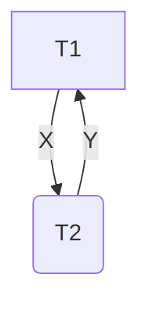
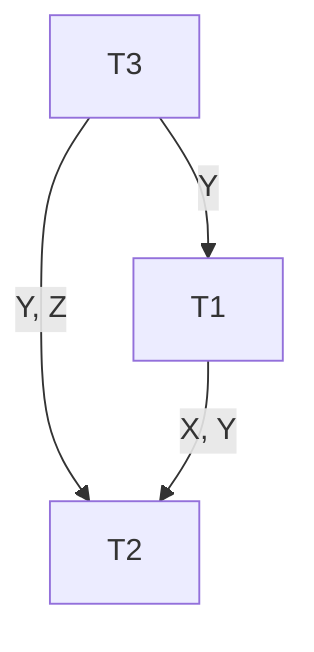
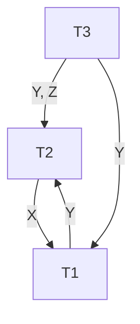

# Concurrency

The goal of concurrency

- Support more than 1 user/query at the same time
- Sequential queues are too slow
- Concurrent: Allow access to the database at the same time in an interleaved fashion, but ensure the same result
- Schedule: A sequence of operations from one or more transactions
  - Operations considered: Read, Write (Start, commit, end, abort)
  - In concurrent transactions, operations are interleaved

# Types of Schedules

- Serial
  - A schedule $S$ is serial if, for every transaction $T$ participating in the schedule, all the operations of $T$ are executed consecutively in the schedule
  - The simplest schedule, each transaction gets its turn to have the whole database to itself, while others wait their turn
- Serializable
  - A schedule $S$ is serializable if it is equivalent to some serial schedule of the same $n$ transactions
    - Same result for serializable and serial schedule
  - Typically, here the operations of different transactions are interleaved, but without creating issues
  - These are the schedules we want to create (Fast, multi-user access and correct)

Consider 2 database transactions $X$ and $Y$, with program variables $x$ and $y$

- Criterion for correctness $X = Y$
- 2 concurrent transactions
  - $T_1: X \leftarrow X + 1, Y \leftarrow Y + 1$
  - $T_2: X \leftarrow 2X, Y \leftarrow 2Y$
- Initially, $X = Y = 10$

We have 2 possible serial schedules:

- Execute $T_2$ entirely, then $T_1$, resulting in database $X = Y = 21$
- Execute $T_1$ entirely, then $T_2$, resulting in database $X = Y = 22$

Consider the following serializable schedule:

| $T_1$                | $T_2$             |
| -------------------- | ----------------- |
| read(X, x)           | ""                |
| $x \leftarrow x + 1$ | ""                |
| write(X, x)          | ""                |
| ""                   | read(X, x)        |
| ""                   | $x \leftarrow 2x$ |
| ""                   | write(X, x)       |
| ""                   | read(Y, y)        |
| ""                   | $y \leftarrow 2y$ |
| ""                   | write(Y, y)       |
| read(Y, y)           | ""                |
| $y \leftarrow y + 1$ | ""                |
| write(Y, y)          | ""                |

This schedule is incorrect as $X = 22$ but $Y = 21$

- Concurrent execution of a set of transactions is **correct** if and only if it's results are equivalent to some serial scheduling of those same transactions

# Defining Equivalence of 2 Schedules

2 schedules are **result equivalent** if they produce the **same final state** of the database.

- 2 schedules can be result equivalent on accident, where the state of the database is the same, but their operations differ
- Just because the results are equivalent, does not mean that the schedule is correct

Instead, we look at the operations in the transactions

- Check if operations would interfere with one another
- Notion of **conflict**

## Determining Seriailizability

- Transactions $T_i$ and $T_j$ conflict iff there exists some item $X$, accessed by both $T_i$ and $T_j$ and at least 1 of them wrote to $X$
  - Conflict between transactions forces a certain execution order between them
  - If there are no writes, the database state does not change, so no issue if both of them only read
- Let $I$ and $J$ be consecutive instructions by 2 different transactions with schedule $S$
  - If $I$ and $J$ do not have conflict, we are able to swap the order to produce a new schedule $S'$
  - $S$ and $S'$ are conflict equivalent
- A schedule is **conflict serializable** if it is conflict equivalent to some serial schedule.

## Possible Transaction Conflicts

- Write/Read:
  - `write(X)` by $T_1$ followed by a `read(X)` by $T_2$
  - $T_2$ must be executed after $T_1$, as $T_2$ reads a value provided by $T_1$
- Read/Write:
  - `read(X)` by $T_1$, followed by `write(X)` by $T_2$
  - $T_2$ must be executed after $T_1$, as $T_2$ writes a new value after $T_1$ reads the old value
- Write/Write
  - `write(X)` by $T_1$, followed by `write(X)` by $T_2$
  - $T_2$ must be executed after $T_1$, as $T_2$ overwrites value created by $T_1$
- No conflict:
  - `read(X)` by $T_1$, followed by `read(X)` by $T_2$
  - No implied execution order, because both $T_1$ and $T_2$ read the same value

# Conflict Graph

We use a directed graph to depict scheduling conflicts

- Assumption: No blind writes
  - A blind write occurs when a transaction writes a value without reading it.
- Each transaction is a node
- Edge labelled $X$ from $T_i$ to $T_j$ if $T_i$ conflicts on $X$ and is before $T_j$

| $T_1$                | $T_2$             |
| -------------------- | ----------------- |
| read(X, x)           | ""                |
| $x \leftarrow x + 1$ | ""                |
| write(X, x)          | ""                |
| ""                   | read(X, x)        |
| ""                   | $x \leftarrow 2x$ |
| ""                   | write(X, x)       |
| ""                   | read(Y, y)        |
| ""                   | $y \leftarrow 2y$ |
| ""                   | write(Y, y)       |
| read(Y, y)           | ""                |
| $y \leftarrow y + 1$ | ""                |
| write(Y, y)          | ""                |



If our conflict graph has no cycles, it is a serializable schedule. The conflict equivalent serial schedule is the same as reading from a dependency graph.

If our conflict graph has a cycle, then no conflict equivalent serial schedule exists.

| $T_1$    | $T_2$    | $T_3$    |
| -------- | -------- | -------- |
| ""       | ""       | read(Y)  |
| ""       | ""       | read(Z)  |
| read(X)  | ""       | ""       |
| read(Y)  | ""       | ""       |
| ""       | ""       | write(Y) |
| ""       | ""       | write(Z) |
| ""       | read(Z)  | ""       |
| read(Y)  | ""       | ""       |
| write(Y) | ""       | ""       |
| ""       | read(Y)  | ""       |
| ""       | write(Y) | ""       |
| ""       | read(X)  | ""       |
| ""       | write(X) | ""       |



Equivalent serial schedule: $T_3 \to T_1 \to T_2$

Consider the conflict graph:



There are no equivalent serial schedules, due to the presence of loops

## Testing Serializability

A schedule is conflict serializable if the conflict graph is acyclic

- Topological sort gives us a serialization order
- Need to guarantee serializability
  - Generate a schedule, build conflict graph, test for cycle
  - If cyclic, generate another schedule

## Determining Serializability

Serializability is hard to check

- Interleaving of operations occurs in the operating system, with some scheduler
- Difficult to determine beforehand how the operations are interleaved

Practical approach

- Devise protocols to ensure serialisability
- Not possible to determine when a schedule begins/ends
  - Hence, we reduce the problem to only check a committed projection of the schedule (Operations from only committed transactions)
- Current approach used in most DBMS: Use of locks with 2 phase locking

# Locks for Concurrency Control

Locking is an operation which secures

- Permission to read, and/or
- Permission to write a data item for a transaction
- `lock(X)`: data item $X$ is locked on behalf of requesting transaction, so it obtains access permission. Only this particular transaction can access $X$, no other transaction can access $X$

Unlocking is an operation which removes these permissions from the data item

- `unlock(X)`: data item $X$ is made available to any other transaction

`lock` and `unlock` are atomic operations

Transactions must be well formed

- Must lock the data item before it reads/writes to it
- Must not lock an already locked item, must not try to unlock a free data item

# Lock Modes

There are 2 lock modes:

- Shared mode: `read_lock(X)`
  - More than 1 transaction can apply `read_lock` on `X` for reading its value
  - No `write_lock` can be applied on `X` if the `read_lock` is active
- Exclusive mode: `write_lock`
  - Only 1 `write_lock` on `X` can exist at any given time
  - No `read_lock` can be applied to `X` when a `write_lock` is active

# Lock Manager

The lock manager manages locks on all data items

A lock table is used to keep track of locks

- The lock table contains information about:
  - Identity of transaction locking the data item
  - The data item itself
  - The lock mode on the item
  - Pointer to the next data item locked
- The lock table can be implemented as a linked list

| Transaction ID | Data ID | Lock Mode | Next Item |
| -------------- | ------- | --------- | --------- |
| T1             | X1      | Read      | Next      |
| T2             | X1      | Read      | null      |

The lock manager uses a 2-phase protocol

1. Growing phase
   - Transactions may request locks
   - Transactions may not release locks
2. Shrinking phase
   - Transactions may not request locks
   - Transactions may release locks

When the first lock is released, the transaction moves from phase 1 to phase 2

## Two-Phase with Lock Conversion

1. Growing phase
   - Can acquire a shared lock on $X$
   - Can acquire an exclusive lock on $X$
   - Can upgrade a shared lock to an exclusive lock on $X$
2. Shrinking phase
   - Can release a shared lock
   - Can release an exclusive lock
   - Can downgrade an exclusive lock to a shared lock

This protocol ensure serializability

- If we allow locks to be obtained and released immediately, rollbacks become a problem, causing inconsistent results


If $T_1$ rollsback after `S-LOCK(A)`, this means that $T_2$ just committed a dirty read on $A$. This is why we obtain all the locks first.

# Extended Conflict Graph

With multiple lock modes, we must extend our conflict graph

- Transaction $T_i$ precedes transaction $T_j$ ($T_i \to T_j$) if there exists a data-item $X$ such that
  - $T_i$ has held lock-mode $A$ on $X$
  - $T_j$ has held lock-mode $B$ on $X$
  - $T_j$'s lock is later than $T_i$'s lock
  - At least one of $A$ or $B$ is an exclusive lock
- If $T_i$ precedes $T_j$, then $T_i$ must occur before $T_j$

# Practical 2-Phase Protocol (2PL)

Each transaction issues standard read/write instructions. The system manages the protocol, including lock operations

`read(X)`:

```
if T has lock on X:
    perform read
else:
    wait until no other transaction has write_lock(X)
    grant read_lock(X) to T
    perform read
```

`write(X)`:

```
if T has a write_lock(X):
    perform write
else:
    wait until no other transaction has a lock on X
    if T has read_lock:
        convert to write_lock(X)
    else:
        grant write_lock(X) to T

    perform write
```

Note: For 2PL, we must still follow the growing/shrinking phase:

- Transaction initially starts at growing phase. Locks are obtained by transaction
- Once the transaction releases a lock, it is in shrinking phase. Transaction should not obtain any other locks, only release/downgrade locks

If a transaction obtains a lock after releasing another lock, it violates 2PL

# Deadlock

A cycle of transactions waiting for each other's unlock (cycle wait)

To prevent deadlock:

- A transaction should lock all data items it refers to before it begins execution
- Prevents deadlock since a transaction never waits for a data item

Deadlock detection and resolution

- Scheduler maintains wait-for-graph for detecting cycles
  - If transaction $T_i$ is waiting for resources locked by $T_j$, $T_i$ is blocked. We add $T_i \to T_j$ to the graph ($T_i$ is waiting for $T_j$)
  - A cycle $T_i \to T_j \to T_k \to T_i$ is a cycle
  - If cycle exists, one transaction in the cycle is selected (victim), and aborted

Deadlock avoidance

- Avoid deadlocks by not letting cycles complete
- When a blocking transaction is likely to create a cycle, abort the transaction

Starvation

- A transaction consistently waits or restarts and never completes
- In deadlock resolution, the same transaction may repeatedly be the victim and is aborted

# Versions of 2PL

Conservative:

- Prevent deadlock by locking all desired data items before beginning execution
- May not be realistic/efficient: During execution, a transaction may determine which data items it requires access to - if not requested in the beginning, need to repeatedly abort and start over

Basic

- Transaction locks items incrementally
- May cause deadlocks, but is dealt with in deadlock resolution

| T3              | T4              |
| --------------- | --------------- |
| read_lock (X);  | read_lock (X);  |
| read_item (X);  | read_item (X);  |
| read_lock( Y);  | ""              |
| write_lock (Y); | ""              |
| unlock (X);     | ""              |
| write_item (Y); | ""              |
| unlock ( Y);    | read_lock( Y);  |
| commit;         | read_item ( Y); |
| ""              | write_lock (Y); |
| ""              | unlock (X);     |
| ""              | write_item( Y); |
| ""              | unlock (Y);     |
| ""              | commit;         |

2PL basic: Unlock immediately when entering 2nd phase

Strict

- Stricter version of basic, where exclusive locks are unlocked after a transaction terminates (commit/aborted and rolled back)
- Shared locks are not unlocked
- Most commonly used 2PL algorithm

| T3              | T4              |
| --------------- | --------------- |
| read_lock (X);  | read_lock (X);  |
| read_item (X);  | read_item (X);  |
| read_lock( Y);  | ""              |
| write_lock (Y); | ""              |
| unlock (X);     | ""              |
| write_item (Y); | ""              |
| commit;         | ""              |
| unlock ( Y);    | read_lock( Y);  |
| ""              | read_item (Y);  |
| ""              | write_lock (Y); |
| ""              | unlock (X);     |
| ""              | write_item( Y); |
| ""              | commit;         |
| ""              | unlock (Y);     |

2PL strict: Unlock exclusive locks when terminating

Rigorous

- Even stricter, all unlocking (shared and exclusive) is performed after a transaction terminates (commits, or aborts and rolls back)

| T3              | T4              |
| --------------- | --------------- |
| read_lock (X);  | read_lock (X);  |
| read_item (X);  | read_item (X);  |
| read_lock( Y);  | ""              |
| write_lock (Y); | ""              |
| write_item (Y); | ""              |
| commit;         | ""              |
| unlock (X);     | ""              |
| unlock (Y);     | read_lock(Y);   |
| ""              | read_item (Y);  |
| ""              | write_lock (Y); |
| ""              | write_item( Y); |
| ""              | commit;         |
| ""              | unlock (X);     |
| ""              | unlock (Y);     |

2PL rigorous: unlock when terminating

# Aggressive vs Conservative Protocols

Aggressive:

- Proceed as quickly as possible, even if situation leads to aborts later (Greedy)
- E.g. Practical 2PL

Conservative

- Do not do work that may later be undone (Lazy)
- E.g. Each transaction requests all locks it requires in the beginning, and are held until the end of the transaction
- No deadlock
- Livelock (or starvation) avoided by queuing lock requests
- However, more waiting, loss of concurrency

# Isolation Levels

SQL defines 4 isolation levels, which are choices about what interactions are allowed by transactions that execute at the same time

- How a DBMS implements these isolation levels is highly complex, and a typical DBMS provides its own options
- Picking the right option depends on application

Within a transaction we can say: `SET TRANSACTION ISOLATION LEVEL X`, where `X` can be:

- `SERIALIZABLE`: Equivalent serial execution schedule exists, fulfills ACID
- `REPEATABLE READ`
- `READ COMMITTED`
- `READ UNCOMMITTED`

## Isolation Level Effects

`REPEATABLE READ`

- Weaker than `SERIALIZABLE`
- If a row is read again, then it has the same value
- No dirty read, but more rows may appear (phantom reads)
- Read locks set to rows that have been read

`READ COMMITTED`

- Weaker than `REPEATABLE READ`
- No dirty reads, but not necessarily the same value every time
- Read locks are acquired, but immediately released

`READ UNCOMMITTED`

- Weaker than `READ COMMITTED`
- Dirty reads are possible
  - If a row is read again, it might have a different value
  - Rows may appear and disappear
- Just don't use read locks

## Usages

`Read Uncommitted`: This isolation level can be appropriate when the data you are working with is not critical and doesn't need to be accurate. For example, if you are running a non-critical report and the data is changing rapidly, Read Uncommitted can be used to avoid locking the data and causing performance issues.

`Read Committed`: This isolation level can be appropriate when you need to read the latest committed data but can tolerate non-repeatable reads and phantom reads. For example, in a banking application, you may use Read Committed isolation level to ensure that users can only see committed transactions.

`Repeatable Read`: This isolation level can be appropriate when you need to ensure that the data remains consistent throughout the transaction, and non-repeatable reads are not acceptable. For example, in an inventory management application, Repeatable Read can be used to ensure that the inventory levels are accurate during the entire transaction.

`Serializable`: This isolation level can be appropriate when you need to ensure the highest level of data integrity, and phantom reads are not acceptable. For example, in a financial application where data accuracy is critical, Serializable isolation level can be used to ensure that the transactions are executed sequentially and no phantom reads occur. However, Serializable isolation level can also cause performance issues due to locking, and it should be used only when necessary.

If 2 users are running on different isolation levels:

- Isolation levels only affect how the user themselves sees the database

```sql
-- Sally
SELECT MAX(price) FROM Sells
WHERE bar = ‘J Bar’; -- (max)

SELECT MIN(price) FROM Sells
WHERE bar = ‘J Bar’; -- (min)

-- Joe
DELETE FROM Sells
WHERE bar = ‘J Bar’; -- (del)

INSERT INTO Sells
VALUES(‘J Bar’, ‘Heineken’, 3.50); -- (ins)
```

If Sally uses `READ UNCOMMITTED` and Joe uses `SERIALIZABLE`

- It is possible that Sally sees 0 prices at all ((del)(max)(min)(ins))

If both Sally and Joe use `SERIALIZABLE`

- She will see the database either before or after Joe's transaction, but not in the middle

It is up to the DBMS vendor to decide such behavior

- True isolation in time
- Keep Joe's old prices around to answer Sally's queries

# Serialisability Violations and Isolation Levels

| Isolation Level    | Dirty Read | Non-repeatable Read | Phantom Read |
| ------------------ | ---------- | ------------------- | ------------ |
| `READ UNCOMMITTED` | yes        | yes                 | yes          |
| `READ COMMITTED`   | no         | yes                 | yes          |
| `REPEATABLE READ`  | no         | no                  | yes          |
| `SERIALIZABLE`     | no         | no                  | no           |

# Read-Only Transactions

Transactions that only read will never violate serializability. This can be set in SQL:

```sql
SET TRANSACTION READ ONLY;
```

Other transactions do not need to wait for a `READ ONLY` transaction to finish

# Transactions and Constraints

- Constraints are checked after modifications
- If violated, transaction is rolled back
- Sometimes a transaction must violate a constraint

```sql
CREATE TABLE Chicken (
    chickenID INT PRIMARY KEY,
    eggID INT REFERENCES Egg(eggID)
);

CREATE TABLE Egg(
    eggID INT PRIMARY KEY,
    chickenID INT REFERENCES Chicken(chickenID)
);
```

- A constraint can be declared deferrable by: `DEFERRABLE INITIALLY DEFERRED`
- This constraint will then only be checked on commit
