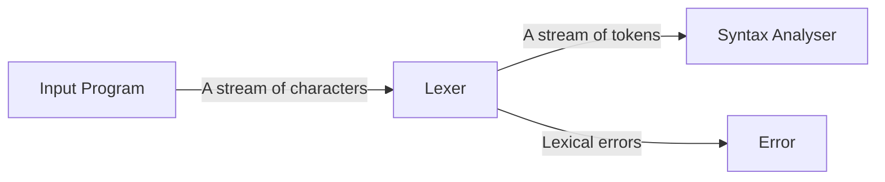
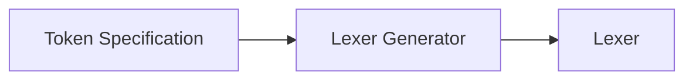

# Lexical Analysis

The lexical analyser (lexer/scanner) transforms the input program from a sequence of characters into a sequence of tokens



- `WHITESPACE` and `COMMENT` are discarded by the lexer
- Each programming language has a set of tokens, each language may have different tokens

# Tokens

A token includes its **type** (such as `IDENTIFIER`) and its string value (lexeme)

| Token type | Lexeme           |
| ---------- | ---------------- |
| WHILE      | "While"          |
| NEQ        | "!="             |
| WHITESPACE | "\t", " ", "\n"  |
| IDENTIFIER | "a2", "u", "i"   |
| MINUS      | "-"              |
| LPAREN     | "("              |
| INTLITERAL | "10", "123", "0" |

- Some token types (e.g. `LPAREN`) have a single lexeme (only one string belongs to this token type)
- Some token types (e.g. `IDENTIFIER`) have many lexemes (a set of strings that belong to this token type)

# Building A Lexical Analyser

1. Define a finite set of tokens, and describe which strings belong to each token
   - Tokens describe all items of interest
   - Choice of tokens depends on language, design of parser
2. Implement lexer. An implementation must do 2 things
   1. Recognise substrings corresponding to tokens
   2. Return type and lexeme of token

For example, a lexer in Java

```java
public class Lexer {
    public class Token { // class for representing tokens
        public enum Type {
            /* keywords */ BOOLEAN, BREAK, ELSE, ...,
            /* punctuation symbols */ COMMA, LBRACKET, LCURLY, ...,
            /* operators */ DIV, EQEQ, EQL, ...,
            /* identifier */ ID,
            /* literals */ INT_LITERAL, STRING_LITERAL, ...,
            ...
        }
    }

    Type type;
    String lexeme;
    publicToken(Type type, String lexeme, ...) { ... }

    private final String source; // input string to be lexed
    private int currentPos; // current position inside input

    // called by the parser, return token starting at position curpos
    public Token nextToken() { ... }
}
```

# Automatically Generating a Lexer

- The way to recognise tokens after reading some characters is the same for all languages
- So a lexer generator can be used to automatically generate a lexer from a high-level specification



- The token specification describes tokens using **regular expressions**

In this course we use the lexer generator JFlex

# Regular Expressions

The definition of a regular expression starts with a finite character set, or alphabet (denoted by $\Sigma$)

- $\lambda$ is a regular expression denoting an empty string ("")
- The symbol $s$ where $s \in \Sigma$ is a regular expression denoting $\{s\}$
- If $A$ and $B$ are regular expressions, then $A|B$ is a regular expression denoting the set of strings which are either in $A$ or $B$ ("|" is the **alternation** operator)
  - "+"|"-" specifies $\{ "+", "-" \}$
- If $A$ and $B$ are regular expressions, then $A.B$ is a regular expression denoting the set of strings which are the **concatenation** of one string in $A$ and one string in $B$
  - "+"|"-" specifies $\{ "+", "-" \}$
- If $A$ is a regular expression, $A^*$ is a regular expression, representing all strings formed by the concatenation of 0 or more selections from $A$ (**Kleene closure**)
- If $A$ is a regular expression, then $(A)$ is a regular expression representing the same set of strings as $A$

Regular expressions are a convenient way to specify various simple (possibly infinite) set of strings

- Using a regular expression, it requires only a few lines of code to check if the user's input matches the regular expression
- An alphabet is a finite set of characters, and a string over an alphabet $\Sigma$ is a finite sequence of characters drawn from $\Sigma$
- A regular expression defines the structure of a set of strings. Each set of strings forms a token class

Operator precendence in decreasing order (Strongest to weakest)

1. $(R)$
2. $R^*$
3. $R_1 R_2$
4. $R_1 | R_2$

## Additional forms/operators

- We usually omit the dot for concatenation
- $A^+$ is the regular expression representing the concatenation of **one or more** selections from $A$ ($A^+ = AA^*$)
- If $k$ is a constant, $A^k$ is a regular expression representing all strings formed by the concatenation of $k$ selections from $A$
- A character class delimited by `[` and `]` represents a single character from the class. Ranges of characters may be separated by a "-"
  - E.g. [0-9], [0123456789]
- Not(s) represents $\Sigma - s$ (any character in $\Sigma$ which is not $s$)
  - E.g. [^0-9] means "not a digit character"
- ? is the optional choice operator
  - E.g. (+|-)?[0-9]+ specifies signed integers

# Automata

We need an algorithm that can recognise (accept) all strings of specified regular expressions, and reject those hwich do not belong to them

- An automaton is a machine that reads a string, and decides whether it is a token specified by a regular expression
- A finite automaton is essentially a graph, with nodes and transition edges
- Nodes represent states, and transition edges represent transitions between state

A finte automaton consists of the following:

1. A finite set of states
2. A fine alphabet $\Sigma$
3. A set of transitions from one state to another, labelled with characters in $\Sigma$ or $\lambda$ ($q_0 \xrightarrow{c} q_1, q_i \xrightarrow{\lambda} q_j$)
4. A start state (has no predecessor states)
5. A subset of the states called the accepting or final states

## Finite Automata

There are 2 types of finite automata:

1. Deterministic finite automata (DFA)
2. Nondeterministic finite automata (NFA)

Deterministic Finite Automata

- Do not allow $\lambda$-transitions
- Do not allow the same character to label transitions from one state to several different states

Nondeterministic Finite Automata

- Have no restrictions on the labels of transitions

A DFA/NFA can be represented by a transition graph

## Conversion of DFA to NFA

Refer to Y3S2 computability and logic

We convert using subset construction

# Lexer Generator and Lexer

A lexer generator

- Translates a regular expression into an NFA
- Converts the NFA into a DFA
- Generates the lexer engine

# Converting Regular Expression to NFA

Use the [McNaughton-Yamada-Thompson](https://www.wikiwand.com/en/Thompson's_construction) algorithm. Try it out [here](<http://cgosorio.es/Seshat/thompson?expr=a.(a%7Cb.a)*%7Cc*.a#:~:text=The%20McNaughton%2DYamada%2DThompson%20algorithm,represented%20by%20the%20regular%20expression.>)

# Lexer Generators

- A very popular lexer generator **Lex** developed by M.E. Lesk and E. Schmidt of AT&T Bell Laboratories. Distributed as part of the Unix System
  - Used primarily with programs written in C or C++ running under Unix
  - Flex is a widely used, freely distributed reimplementation of Lex that produces faster and more reliable lexers
  - JFlex is a similar tool for use with Java
- A lexer specification that defines the tokens and how they are to be processed is presented to JFlex
- JFlex generates a complete lexer coded in Java
- This lexer is combined with other compiler components (syntax analyser etc.) to create a complete compiler

A lexer generator takes as its input a list of rules $R_i$ and $\{A_i\}$, where $R_i$ are regular expressions, and $A_i$ are snippets of Java code

- The generated lexer will read input string one character at a time
- Whenever the input read so far matches some $R_i$, execute the corresponding action $A_i$
- Then continue reading the input

The longest possible match between the input stream and $R_i$ is chosen when matching $R_i$. For example, "123;" will be matched as one token with type `INTEGER` and lexeme "123", and another token `SEMICOLON`

## JFlex Regular Expression Syntax

- Concatenation is written without the dot
- Alternation, repetition and non-empty repetition are written as `a|b`, `a*` and `a+`
- Negation Not(a) is written as `!a`
- Single characters can be written without quotes, only if they don't have special meaning (special characters like \* and +)
- Character classes
  - [0-9] is a character range (no quotes around 0 or 9)
  - [123] means 1 | 2 | 3
  - Can be combined (e.g. [a-z0-9])
  - If the character class starts with `^`, it is negated (e.g. [^0-9])

## JFlex Definition File

- This is the input file to the lexer generator
- The general structure of JFlex definition files has 3 sections
  1. User code: Copied to `lexer.java` before the lexer class declaration
  2. %% Declarations: Macro declarations - abbreviations to make lexical specifications easier to read and understand
  3. Regular expression rules

Example of a simple arithmetic expression:

```java
%%
Digit = [0-9]
Alpha = [a-zA-Z_]
%%
"+" { return new Token(PLUS, yytext()); }
"-" { return new Token(MINUS, yytext()); }
"*" { return new Token(MULT, yytext()); }
"/" { return new Token(DIV, yytext()); }
"(" { return new Token(LPAREN, yytext()); }
")" { return new Token(RPAREN, yytext()); }
("+"|"-")?{Digit}+ { return new Token(INTLIT, yytext()); }
{Alpha}({Alpha}|{Digit})* { return new Token(IDENTIFIER, yytext()); }
[ \t\n] { /* skip blank, tab and end of line chars */}
```

- Note that `yytext` is a method provided by JFlex, which returns the text matched by the regular expression
- From this specification, JFlexd generates a class `Lexer` whose skeleton is:

```java
public class Lexer {
    public Lexer(InputStream in) {
        ...
    }
    public Token nextToken() {
        ...
    }
}
```

## Resolving Ambiguities and Error Handling

- There is often more than 1 way to partition a given input string into tokens
- JFlex disambiguates this case using the longest match rule: If 2 different regular expressions $R_i$ and $R_j$ both match the start of the input, it chooses the one that matches the longer string
- If both $R_i$ and $R_j$ match the same number of characters, it prefers the one that occurs earlier in the specification. This is useful to introduce "catch all" rules for error reporting

  - For instance, we can add the following rule to the end of our specification

  ```java
  . {
      System.err.println("Unexpected character " +
      yytext() + " " + "at line " +
      yyline + ", column " + yycolumn);
  }
  ```

  - The dot character matches any input symbol
  - This rule will only fire if none of the other rules do
  - The action prints an explanatory error message, and skips over the offending character
  - `yyline` and `yycolumn` are provided by JFlex, which contain information about the current source position

## Processing Reserved Words

- Virtually all programming languages have **keywords**, which are reserved. They are called reserved words
- Keywords also match the lexical syntax of ordinary identifiers
- One possible approach: Create distinct regular expressions for each reserved word before the rule for identifiers. For example:

```java
%%
...

"if" {return new Token(IF, ""); }
"break" {return new Token(BREAK, ""): }

...

{Alpha}({Alpha}|{Digit})* { return new Token(IDENTIFIER,
yytext()); }
```

- However, this significantly increases size of transition table
- An alternative approach: after an apparent identifier is recognised, look up the lexeme in a keyword table to see if it is a keyword. For example,

  ```java
  {Alpha} ({Alpha}|{Digit})* {
    word = yytext();
    token = lookUp(keywordTable, word);
    return token;
  }
  ```

- `lookUp` will return the token for a keyword if `word` matches one of the keywords, or return `IDENTIFIER` token if it does not match any keywords
