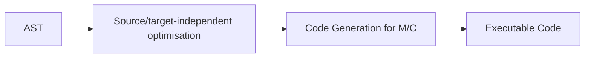
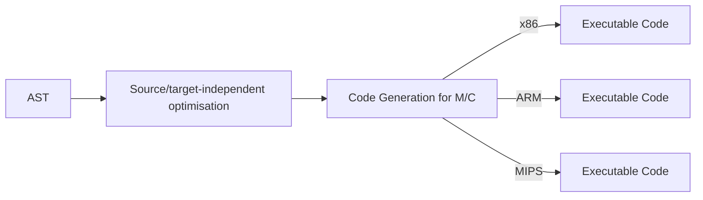
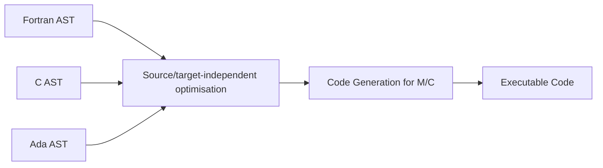

# Code Generation

Recall 
- We have a source program
- We feed a source program into the compiler to run analysis
  - Lexical analysis
  - Syntax analysis
  - Semantic Analysis

Now, we cover the synthesis phase
- Optimisation
- Code generation

# Overview

The code generator produces executable code from an abstract syntax tree representation of a program
- Code generator produces code that is equivalent to the source program and runs on a machine
- Code that correctly uses the memory space allocated by the OS to the program
- Code that is smaller or faster - optimisations may be performed

The execution of a program is initially controlled by the OS. When a program is invoked
- The OS allocates memory space (may not be contiguous) to the program
- The code is loaded into part of the space
- The execution jumps to the entry point (the first instruction)

Code generator will
- Generate code from AST
- Orchestrate the use of data space

Memory layout
- Code area: For most languages, fixed size and read only
- Static data: Statically allocated data like global variables and constants
- Stack: Parameters and local variables of methods as they are invoked. Each invocation of a method creates a stack frame which is pushed onto the stack
- Heap: Dynamically allocated data, e.g. class instances
- Stack and heap grow towards each other

## Use of the Stack

```
main() {
    g();
    f();
}

f() {
    return g();
}

g() {
    return 1;
}
```

1. `g()` is pushed onto the stack
2. `g` returns `1`, and is pushed off the stack
3. `f` is called and pushed onto the stack
4. `f` calls `g`, and `g` is now pushed on the stack
5. `g` returns 1, and is popped off the stack
6. `f` returns 1, and is popped off the stack

The chain of method calls are dynamic: it may be different for every program input. Method calls are nested. So a stack can correctly track current active calls, and make sure when one call terminates, it returns to the caller

The stack holds a sequence of frames
- When a function/method is called, control jumps to the entry point of the called method
- When a function/method terminates, control returns to the point immediately after the call in the caller's code
- The information needed to manage one call is stored in one frame

The code generator must determine the layout of a frame and generate code that correctly accesses locations in a frame - frame layout and code generator are designed together

## Multi-pass Process to Generate Code

The task of code generation is often split up into several different passes
- The task of translating from AST to executable code can be simplified by breaking it into several passes
- Each pass performs a different optimisation/transformation
- It is easier a certain pass to work on or produce a certain intermediate representation



Some compilers such as `gcc` or `llvm` support multiple different target platforms



Conversely, some compilers support multiple input languages



## Generating Virtual Machine Code

- Compiler may produce virtual machine code which needs an interpreter to run on a physical machine
- The advantage is that many different languages may use such a compiler, and do not have to generate code for different physical machines
- Such VM codes are known as bytecodes, and the interpreters running them as virtual machines
- E.g. Java Virtual Machine, Common Language Runtime

## Compiling to Bytecode vs Executable Code

Advantages of compiling to bytecode
- Only need to generate code for one platform: The virtual machine
- Native instruction sets emphasise efficient execution over ease of compilation, so code generation is difficult
- Virtual machine instruction sets and runtime environments are often more high-level than their native counterparts: e.g. both JVM and CLR offer automated garbage collection
- Virtual machine optimisation benefit every compiler targeting it
- Bytecode is often more compact than native code: particularly suitable for resource-constrained platforms such as mobile phones

Advantages of compiling to native code
- Running code on a virtual machine is generally slower than running native code

## JIT Compilation 

- Modern virtual machines are rarely pure interpreters
- Usually they compile bytecode to native code on-the-fly; this is known as just in time (JIT) compilation
- Tradeoff: Native code is faster, but compilation takes time
  - JIT compilation able to observe runtime program properties and this can help improve code performance
- Often, only heavily used (hot) parts of the program are compiled and cached, the rest is interpreted
  - Once a method has been executed several times, it is compiled to native code: Code that can be directly executed by the underlying computer
  - The compiled native code is cached so that it may be reused in subsequent invocations of the method
- Modern JIT compilers also exploit runtime profilling for optimisation, hence they can perform more targeted optimisations than compilers targeting native code directly
- Consequently, JIT based VMs are now competitive with native code for most application areas except heavy numeric computations

# Overview of the Java Virtual Machine (JVM)

- The JVM interprets class files, each describing a single class
- Usually, class files are produced by a Java compiler, but there are other compilers that also target the JVM
- The JVM automatically loads any other classes referenced from the class files it is executing

## Inside a Class File

A class file contains
- Name of the class itself, and its superclass and superinterfaces
- Descriptions of the class' members
  - For fields: accessibility, type, name
  - For methods: accessibility, return type, name, parameter types, bytecode for method body
- This information is encoded as binary data, so a class file is not human-readable
- Command line tool for displaying information in a class file in readable form: `javap -v Test`

## Names in Class Files

- Names of classes, interfaces and fields are always given in fully-qualified forms, including their package name
  - `java.lang.String`
  - `java.lang.System.out`
- For methods, their name includes their full signature (i.e. types of method parameters), but not return type
  - `java.lang.String.indexOf(int)`
  - `java.lang.String.indexOf(int, int)`
- This every class, interface, field and method in the program has a unique name
- Local variables and parameters do not have names in bytecode, they are represented by numerical indices

## JVM Loop

```
do {
    fetch an opcode;
    if (operands) fetch operands;
    execute the action for the opcode;
} while (there is more to do)
```

A JVM instruction consists of
- An operation code (opcode) specifying the operation to be executed
- Zero or more operands supplying arguments or data

## Bytecode

- All code to be executed by the JVM has to be expressed as JVM butecode
- JVM bytecode consists of a sequence of instructions, each performing a single operation, such as adding 2 numbewrs or reading the value of a variable
- Unlike java expressions, JVM instructions cannot be nested, so if one instruction needs to use a value computed by another instruction, it has to be explicitly stored into and read from a temporary location
- Native platforms such as x86 use registers for this purpose, but the JVM uses an operand stack: instructions take their operands from the stack, and push their result back onto it

## Runtime Memory Organisation

Per thread
- The PC register: contains address of instruction being executed
- Stack: Divided into frames, used to store the values of parameters and local variables, as well as intermediate results

Shared among all JVM threads
- Method area: Used to store per-class structures such as constant pools (for strings/numerical constants), data and code for fields/methods etc
- The heap: Used to store objects and arrays

### Constant Pool

- The constant pool contains all numerical and string constants used in the program: in particular, it contains string constants for all class/method/field names referenced in the code
- Bytecode instructions that need to use constants contain indices into the constant pool where the actual value is found
- This saves space: different instructions that use the same constant can refer to the same constant in the constant pool
- For very commonly used small constants (-1, 0, 1, 2, 3, 4), the JVM offers specialised bytecode instructions such as `iconst_0`, and pushes the constant `0` onto the stack; these constants do not need to be stored in the constant pool
- Each stack frame contains a reference to the constant pool for the class of the frame's method

### Stack

- The stack is used to store local variables (including method parameters) and intermediate computation results
- It is subdivided into frames: whenever a method is invoked, a new frame is pushed onto teh stack to store local variables and intermediate results for this method. When the method exits, its frame is popped off, exposing the frame of its caller beneath it
- Every frame in turn consists of 2 parts: A block of local slots for storing local variables, and an operand stack on top of it
- A bytecode method has to indicate how many local slots it needs, and how big its operand stack can get; thus, the size of a frame for a method is always fixed
- Note that for non-static methods, slot 0 holds `this`, the object's self reference

### Stack Types

Every element on the stack (both locals and intermediate results) has to be one of the following types
- `int`: 32-bit integer
- `long`: 64-bit integer
- `float`: 32-bit floating point
- `double`: 64-bit floating point
- `address`: Pointer to an object or array on the heap

`byte`, `char`, `short` are stored as `int`; values of type `boolean` are stored as integers 0 and 1

### Heap

- The heap is used to store arrays and objects
- JVM specification does not mandate a particular layout for the heap, but usually objects are stored like this:
  - class, field1, field2, ..., fieldn
  - `class` is the name of the object's class (index into constant pool)
  - `field` are values to object's fields (may point to other objects)
- Objects are represented on the stack as references into the heap, which is shared among all JVM threads
- Objects on the heap are only removed by the garbage collector

### Bytecode Instruction Set

- The JVM defines 256 instructions, encoded as numbers from 0-255 (fits into a single byte, hence the name bytecode)
- All JVM instructions also have mnemonic names
- Most instructions take operands from the stack, and leave their result on top of the stack
- Additionally, some instructions take extra operands that are encoded together with the instructions in the bytecode; such instructions are longer than 1 byte
- Almost all JVM instructions only operate on a single type of data: there are usually several variant instructions performing the same operation on different data types

## Instruction Categories

There are 8 categories of instructions
1. Load and store
2. Arithmetic
3. Type conversion
4. Object creation and manipulation
5. Operand stack management 
6. Control transfer
7. Method invocation and return
8. Others

### Load and Store Instructions

Instructions for loading constants onto the stack

| Instruction                        | Description                      |
| ---------------------------------- | -------------------------------- |
| `iconst_0, ..., iconst_5`          | push int constant 0, ..., 5      |
| `iconst_m1`                        | push int constant -1             |
| `lconst_i`, `fconst_i`, `dconst_i` | same for long, float and double  |
| `aconst_null`                      | push constant `null`             |
| `ldc`                              | push constant from constant pool |

Instructions for loading local variables onto the stack

| Instruction                          | Description                                         |
| ------------------------------------ | --------------------------------------------------- |
| `iload_0`, ..., `iload_3`, `iload i` | push local int variable 0, ..., 3, i onto the stack |
| `lload`, `fload`, `dload`, `aload`   | same for long, float, double, address               |

- Instructions for storing the value on top of the stack into a local variable are similar: `istore`, `lstore`, etc

### Arithmetic Instructions

- These instructions correspond to Java's arithmetic and logical operators, but each instruction only works on operands of one type
- Operands are popped off the stack, result is pushed back onto the stack

| Instruction                    | Description                                                                                 |
| ------------------------------ | ------------------------------------------------------------------------------------------- |
| `iadd`, `ladd`, `fadd`, `dadd` | Addition (int, long, float, double)                                                         |
| `isub`, `lsub`, `fsub`, `dsub` | Subtraction (int, long, float, double)                                                      |
| `tdiv`, `trem`, `tneg`         | Division, module, negation (`t` is the type, 4 variants)                                    |
| `ishl`, `ishr`, `iushr`        | Arithmetic shift left, arithmetic shift right, logical shift right on int (`lshl` for long) |
| `ior`, `iand`, `ixor`          | or, and, xor on int (`lor` for long or)                                                     |

- Logic shift is defined as a shift of bits either left or right with vacant bits filled up with zeros. 
- Arithmetic shift is defined as shift of bits either left or right with sign bit preserved if possible. 
- Arithmetic shift diffs from logic shift only when negative numbers are involved.

There are also instructions `lcmp`, `fcmp`, `dcmp` for comparing values of type long, float and double
- They each pop operands `y` and `x` off the stack, then compare them. If `x > y`, push 1. If `x < y`, push -1. Else push 0
- There is no such instruction for `int`: Comparisons between integers always take the form of conditional jumps. Reason [here](https://stackoverflow.com/questions/29131376/why-is-there-no-icmp-instruction#:~:text=The%20main%20reason%20why%20there,is%20neither%20necessary%2C%20nor%20beneficial.&text=if%20(x%20%3E%20y)%20return,of%20the%20existing%20if_icmp)
- Conversely, conditional jumps cannot directly compare longs, floats or doubles, but have to use `lcmp`, `fcmp` or `dcmp` and then compare their integer result against 0

### Type Conversion Instructions

Arithmetic instructions require both of their operands to have the same type
- If they are of different types, one has to be converted using a type conversion instruction first
- Widening conversions: `i2l` (int to long), `i2f`, `i2d`, `l2f`, `l2d`, `f2d`
- Narrowing conversions: `l2i`, `f2i`, `f2l`, `d2i`, `d2l`, `d2f`
- Integers can also be converted to byte, short or char: `i2b`, `i2s`, `i2c`. These instructions do not change the type of the top stack element (remember that stack elements cannot be of types smaller than int), but truncate its value
- Note that there are no conversions from/to address

### Object Creation and Manipulation

- Create a new class instance `new "java.lang.String"`
  - Class name stored in constant pool
  - This only allocates memory, it does not invoke the constructor
  - `invokespecial` will do this
- Similar instruction `newarray` for allocating arrays
- Read instance field value: `getfield "A.f"`
  - The topmost stack value specifies the object whose field `f` is read
- Instruction `putfield` writes to field, instructions `getstatic` and `putstatic` accesses static fields
- Special instruction `arraylength` to read the length of an array
- Instructions `iaload`, `iastore` access elements of int arrays; similar for other types
- Instructions `instanceof`, `checkcast` do dynamic type checks

### Operand Stack Management Instructions

- `dup`: Duplicate top stack element
- `pop`: Pop off top stack element
- Many other, less commonly used instructions
- These are the only type-generic instructions: one instruction to handle all possible types

### Control Transfer Instructions

- Unconditional jump to instruction at address `t`: `goto t`
- Conditional jumps pop off `y` and `x`. If some condition is true, then jump to `t`, otherwise continue with next instruction

| Instruction   | Description                                                                                         |
| ------------- | --------------------------------------------------------------------------------------------------- |
| `if_icmpeq t` | `x` and `y` must be ints, jump to `t` if `x == y`. `if_icmpne/lt/le/ge/gt` jump if !=, <, <=, >=, > |
| `if_acmpeq t` | `x` and `y` must be addresses: jump to `t` if `x == y`; `if_acmpne` jumps if `x != y`               |


- Instructions `ifeq`, `ifne`, `iflt`, `ifle`, `ifgt`, `ifge` are similar: they only pop off a single int operand `x` and compare it to 0
- `ifnull`, `ifnonnull` pops off an address operand and compares it to null
- We do not discuss `tableswitch` and `lookupswitch`

### Method Invocation and Return Instructions

- Arguments are pushed onto the stack (receiver object first), then the following instructions are used to invoke the method
  - `invokevirtual` for normal, nonstatic methods
  - `invokeinterface` for methods declared in interfaces
  - `invokespecial` for super calls, instance initialisation and private methods
  - `invokestatic` for static methods (no receiver object)
- The operand of the invoke instruction is the signature of the method to invoke; in particular, it indicates how many arguments the method expects
- When a method exits, it uses `ireturn` (`lreturn`, `freturn`, `dreturn`, `areturn`) to return the value on top of the stack, or `return` to exit without returning a value
- Return value is left on top of the caller's operand stack

### Other Instructions

- Exception throwing: `athrow`
- Synchronisation: `monitorenter`, `monitorexit`
- `nop`: do nothing

# Soot

Soot is an optimisation framework for JVM bytecode
- Soot defines several higher level intermediate representations for bytecode that are easier to work with, transform and optimise than JVM bytecode
- We will use Soot as a library for generating bytecode
- It is also possible to generate bytecode directly from an AST, but Soot's intermediate representations are more convenient

## Soot's Intermediate Representations

Soot defines 4 intermediate representations for bytecode
1. Baf: Similar to bytecode; same instructions, but abstracts away from constant pool (constants are embedded in code) and type prefixes (e.g. there is only one `add` instruction)
2. Jumple: Most important IR; instructions similar to bytecode, but explicitly uses named temporary variables instead of opeand stack. Only 15 instructions compared to 256 bytecode instructions
3. Shimple: Variant of Jimple, where each local variable is assigned at most once (Static Single Assignment); better for some optimisations
4. Grimp: High-level representation with nested expressions (hence no need for operand stack); control flow still encoded as jumps

Soot provides translators between these 4 IRs and JVM bytecode; can also read in `.class` files directly

## Soot's High-level Data Abstractions

- Program/package -> scene
- Class/module -> SootClass
- Field -> SootField
- Method/Function -> SootMethod
- Statement -> Unit

### SootClass

A SootClass is made up of `SootField`s and `SootMethod`s
- Fields and methods are added to a class using `SootClass.addField` and `SootClass.addMethod` respectively

### SootMethod

A SootMethod has a `JimpleBody`, and the `JimpleBody` is made up a a chain of `Unit`s and a chain of `Local`s

- The body is set using `SootMethod.setActiveBody`
- The `Unit`s and `Local`s are added to the respective chains
  - `body.getUnits().add(stmt)`
  - `body.getLocals().add(var)`

### Jimple Overview

- Jimple is a typical example of what is known as a 3-address code intermediate representation
- Most instructions work on three operands, which all denote local variables (addresses): two operands are inputs, and one operand is where the output result is stored
- For example, x = y + z
  - y and z are inputs, and x is the output
- Crucially, y and z cannot themselves be complex expressions. Temporary variables have to be used to compute nested expressions
- Of course, some instructions have less than 3 operands
- In bytecode, most operands are implicit. In Jimple, all operands are explicit

### Jimple Expressions and Statements: Examples

- To create expressions or statements, we use factory methods in the `Jimple` class (use method `Jimple.v()` to obtain the singleton instance of class `Jimple` first)
- Addition expression in Jimple: `Jimple.newAddExpr(Value op1, Value op2)`
- If statement: `Jimple.newIfStmt(CmpExpr cond, Unit target)`
- Do nothing: `Jimple.newNopStmt()`

Most of the time, to illustrate code generation, we use Jimple-like instructions, which are in 3-address format
- The key is operands should not be complex expressions
- Some typical Jimple-like instructions:
  - `x = y op z`, where `x`, `y`, `z` are variables or literals, and `op` is an arithmetic operator
  - `goto L` where `L` is a label
  - `if x # y goto L` where `#` is a relational operator
  - `x = y`
  - `return x`

Valid 3-address forms:
- `a = b + c`
- `x = y`
- `r = fib(n)`
- `r = foo(a, b, c)`
- `if a > b goto label0`

Invalid 3-address forms
- `r = fib(n - 1)`
- `a = b * c + d`
- `if a + 1 > b goto label0`