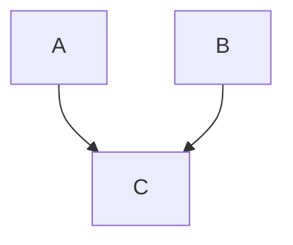
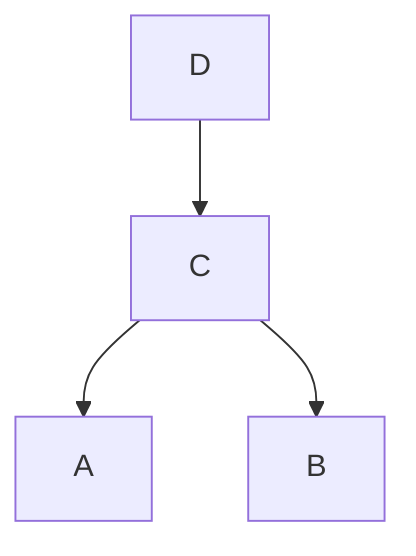
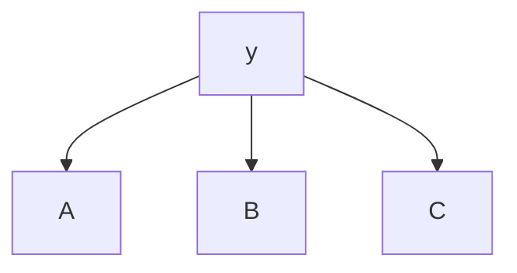

# Bayesian Belief Networks

Recall the naive bayes classifier, which assumes that features are conditionally independent given the class label:

$$
P(\bold{x} | y = c) = \prod_{i = 1}^{d} P(x_i | y = c)
$$

where $\bold{x} = [x_1, ..., x_d]$

However, conditional independence assumptions may not hold in practice, and correlated features can degrade the performance

For example,

- Suppose the probability of a person having a specific disease $D$ is 50%
- There are 2 medical tests $T_1$ and $T_2$ of binary values (positive or negative)
  - Outcomes of $T_2$ are perfectly positively correlated with $T_1$ if a person has the disease, but are independent of $T_1$ if the person does not have the disease
    - If a person has the disease, the outcomes of $T_1$ and $T_2$ are both the same
    - If a person does not have the disease, the outcomes of $T_1$ and $T_2$ may be different
  - If a person has the disease, the probabilities of $T_1$ and $T_2$ being negative are 40%
  - If a person does not have the diesase, the probabilities of $T_1$ and $T_2$ being negative are 60% and 65% respectively
- If $T_1$ and $T_2$ are both negative for a particular patient, diagnose whether the patient has the disease

We define the following variables:

- $X_1$ is the outcome of $T_1$
  - $X_1 = 1$: Positive
  - $X_1 = 0$: Negative
- $X_2$ is the outcome of $T_2$
  - $X_2 = 1$: Positive
  - $X_2 = 0$: Negative
- Let $Y$ denote whether a person has disease $D$
  - $Y = 1$: Yes
  - $Y = 0$: No

We can calculate probabilities

- The probability of a person having disease $D$ is 50%
  - $P(Y = 0) = 0.5$
  - $P(Y = 1) = 0.5$
- The outcomes of $T_2$ are perfectly positively correlated with $T_1$ if a person has the disease
  - If the person has disease $D$:
    - If the outcome of $T_1$ is positive, the outcome of $T_2$ will always be positive
    - If the outcome of $T_1$ is negative, the outcome of $T_2$ will always be negative
  - Hence, $P(X_1 = 1, X_2 = 1 | Y = 1) = P(X_1 = 1 | Y = 1)$
  - Similarly, $P(X_1 = 0, X_2 = 0 | Y = 1) = P(X_1 = 0 | Y = 1)$
- The outcomes of $T_1$ and $T_2$ are independent if the person does not have the disease
  - $P(X_1 = 1, X_2 = 1 | Y = 0) = P(X_1 = 1 | Y = 0) P(X_2 = 1 | Y = 0)$
  - $P(X_1 = 1, X_2 = 0 | Y = 0) = P(X_1 = 1 | Y = 0) P(X_2 = 0 | Y = 0)$
  - $P(X_1 = 0, X_2 = 1 | Y = 0) = P(X_1 = 0 | Y = 0) P(X_2 = 1 | Y = 0)$
  - $P(X_1 = 0, X_2 = 0 | Y = 0) = P(X_1 = 0 | Y = 0) P(X_2 = 0 | Y = 0)$
- If the person has the disease, the probabilities of test $T_1$ and $T_2$ being negative are 40%
  - $P(X_1 = 0 | Y = 1) = 0.4 \implies P(X_1 = 1 | Y = 1) = 1 - 0.4 = 0.6$
  - $P(X_2 = 0 | Y = 1) = 0.4 \implies P(X_2 = 1 | Y = 1) = 1 - 0.4 = 0.6$
- If the person does not have the disease, the probabilities of $T_1$ and $T_2$ being negative are 60% and 65% respectively
  - $P(X_1 = 0 | Y = 0) = 0.6 \implies P(X_1 = 1 | Y = 0) = 1 - 0.6 = 0.4$
  - $P(X_2 = 0 | Y = 0) = 0.65 \implies P(X_2 = 1 | Y = 0) = 1 - 0.65 = 0.35$

We are given that $X_1 = 0$ and $X_2 = 0$. We want to find the following probabilties

- $P(Y = 0 | X_1 = 0, X_2 = 0)$
- $P(Y = 1 | X_1 = 0, X_2 = 0)$

We can calculate the following:

The probability that the patient **does not have** the disease given that $T_1$ and $T_2$ are both negative:

$$
\begin{aligned}
P(Y = 0 | X_1 = 0, X_2 = 0) &= \frac{P(X_1 = 0, X_2 = 0 | Y = 0) P(Y = 0)}{P(X_1 = 0, X_2 = 0)} \\
&= \frac{P(X_1 = 0 | Y = 0) P(Y = 0)}{P(X_1 = 0, X_2 = 0)} \\
&= \frac{(0.6)(0.65)(0.5)}{P(X_1 = 0, X_2 = 0)} \\
&= \frac{0.195}{P(X_1 = 0, X_2 = 0)}
\end{aligned}
$$

The probability that the patient **has** the disease given that $T_1$ and $T_2$ are both negative:

$$
\begin{aligned}
P(Y = 1 | X_1 = 0, X_2 = 0) &= \frac{P(X_1 = 0, X_2 = 0 | Y = 1) P(Y = 1)}{P(X_1 = 0, X_2 = 0)} \\
&= \frac{P(X_1 = 0 | Y = 0) P(Y = 0)}{P(X_1 = 0, X_2 = 0)} \\
&= \frac{(0.4)(0.5)}{P(X_1 = 0, X_2 = 0)} \\
&= \frac{0.2}{P(X_1 = 0, X_2 = 0)}
\end{aligned}
$$

Since $P(Y = 1 | X_1 = 0, X_2 = 0) > P(Y = 0 | X_1 = 0, X_2 = 0)$, we predict that the patient has the disease

Note that, if we used naive bayes and assumed that $T_1$ and $T_2$ are independent, then

$$
\begin{aligned}
P(Y = 1 | X_1 = 0, X_2 = 0) &= \frac{P(X_1 = 0, X_2 = 0 | Y = 1) P(Y = 1)}{P(X_1 = 0, X_2 = 0)} \\
&= \frac{P(X_1 = 0 | Y = 0) P(X_2 = 0 | Y = 0) P(Y = 0)}{P(X_1 = 0, X_2 = 0)} \\
&= \frac{(0.4)(0.4)(0.5)}{P(X_1 = 0, X_2 = 0)} \\
&= \frac{0.08}{P(X_1 = 0, X_2 = 0)}
\end{aligned}
$$

Using naive bayes, since $P(Y = 1 | X_1 = 0, X_2 = 0) < P(Y = 0 | X_1 = 0, X_2 = 0)$, we predict that the patient does not have the disease. Wrongly assuming independence between $T_1$ and $T_2$ when the patient has the disease has given us an incorrect result

# Bayesian Belief Networks (BBN)

- A more general approach to modelling the independence and conditional independence among $\bold{x}$ and $y$ such that the computation of $P(\bold{x}, y) = P(\bold{x} | y)P(y)$ is tractable (easier to control/influence)
  - We suppose all features are discrete
  - If there are both continuous and discrete features, the estimation is much more difficult
- Representation: A Bayesian network provides a graphical representation of the probabilisitc relationships among a set of random variables, including features and output class

There are 2 key elements for a BBN

1. A directed acyclic graph (DAG) encoding the dependence relationship among a set of variables
2. A probabilty table associating each node to its immediate parent nodes

## DAG Example

Consider 3 random variables $A, B, C$, where $A, B$ are independent, and each has a direct influence on $C$

- $P(A, B) = P(A) P(B)$
- $C$ is influenced by $B$
- $C$ is influenced by $A$

We can model the dependence using a DAG

### DAG: Conditional Independence

A node in a Bayesian network is conditionally independent of its non-descendants if its parents are known. For example:

- $B$ is conditionally independent of $A$ and $D$, since they are non-descendants of $B$
- $B$ is conditionally dependent on $C$, because $C$ is a direct parent
- $P(B | C, A, D) = P(B | C)$

### Special Case: Naive Bayes

A naive bayes classifier can be represented using a special DAG

All features are only conditionally dependent on the class label $y$, and are independent of each other

## BBN Representation

Besides conditional independence conditions imposed by the network topology, each node is also associated with the probability table

- If a node $X$ does not have any parents, then the table only contains the prior probability $P(X)$
- If a node $X$ has only 1 parent $Z$, then the table contains the conditional probability $P(X | Z)$
- If a node $X$ has multiple parents $Z_1, ..., Z_k$, then the table contains the conditionaly probability $P(X | Z_1, ..., Z_k)$

## BBN Model Building

There are 2 steps in the training phase

1. Create the structure of the network
   - Network topology can be obtained by encoding the subject knowledge of domain experts
   - Or can be learned from data (structured learning) - Still an open problem
2. Estimating probability values in the table associated with each node
   - Counting based on the definition of the corresponding probabilities

Note: In this module we only focus on how to use a BBN to make predictions

## Using BBNs for Inference

Given a BBN and an inference/prediction task

1. Translate the problem into a probabilistic language, i.e., what probabilities to be estimated?
2. If probabilities to be estimated cannot be obtained from the probability tables of the BBN, then
   - Identify subgraph which captures the dependence between input variables and output variable
   - Based on network topology, apply product rule, sum rule and properties of conditional independence and independence to induce equivalent forms of the probabilities, until all the probabilities can be found from the probability tables
