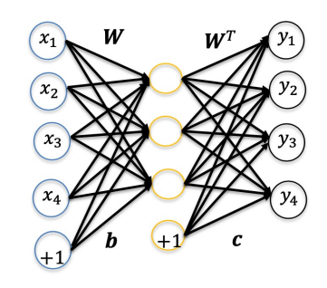
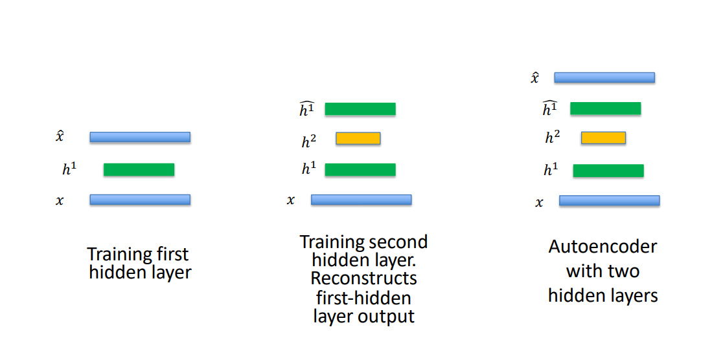
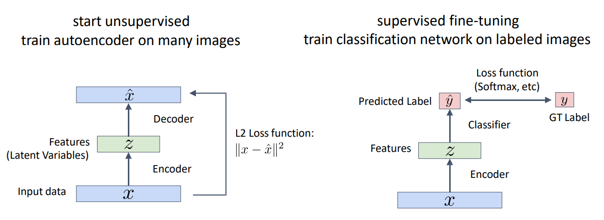

# AutoEncoders

Autoencoders are an unsupervised method for learning feature vectors from raw data without any labels

-   Features should extract useful information that we can use for downstream tasks

How to learn this feature transform from raw data?

-   Use features to reconstruct the input data with a decoder

An autoencoder is a neural network trained to attempt to copy its input to its output

-   Hidden layer describes a code that represents the output
-   Consists of 2 parts: Encoder and Decoder

Given an input $\bold{x}$, the hidden-layer performs the encoding function $\bold{h} = \phi(\bold{x})$, and the decoder $\varphi$ produces the reconstruction $\bold{y} = \phi(\bold{h})$

$$
\begin{aligned}
    \bold{h} &= \phi(\bold{x}) \\
    \bold{y} &= \varphi(\bold{h})
\end{aligned}
$$

If the autoencoder succeeds, it should be able to copy its input to the output

$$
\bold{y} = \varphi(\phi(\bold{x})) = \bold{x}
$$

We can optionally constrain the weights in the encoder and the decoder

-   Encoder weight matrix: $\bold{W}$
-   Decoder weight matrix: $\bold{W}^T$

Then the hidden and output layer activations can be written as:

$$
\begin{aligned}
    \bold{h} &= f(\bold{W}^T\bold{x} + \bold{b}) \\
    \bold{y} &= f(\bold{W}\bold{h} + \bold{c})
\end{aligned}
$$

# Training Autoencoders

The cost function for reconstruction can be measured in various ways depending on the appropriate distributional assumption on the inputs

Given a training set $\{\bold{x}_p\}_{p=1}^{P}$, we can use the MSE if the data is assumed to be continuous and Gaussian distributed

$$
J_{\text{MSE}} = \frac{1}{P} \sum_{p=1}^{P} \lVert \bold{y}_p - \bold{x}_p \rVert^2
$$

-   $\bold{y}_p$: Output for input $\bold{x}_p$

If inputs are interpreted as bit-vectors, or vectors of bit-probabilities, we use the cross-entropy of reconstruction

$$
J_{\text{cross-entropy}} = -\sum_{p=1}^{P} \bold{x}_p \log \bold{y}_p + (1 - \bold{x}_p) \log (1 - \bold{y}_p)
$$

After choosing a cost function $J$, we can learn using gradient descent

$$
\begin{aligned}
    \bold{W} &\leftarrow \bold{W} - \alpha \nabla_\bold{W} J \\
    \bold{b} &\leftarrow \bold{b} - \alpha \nabla_\bold{b} J \\
    \bold{c} &\leftarrow \bold{c} - \alpha \nabla_\bold{c} J \\
\end{aligned}
$$

# Denoising Autoencoders (DAE)

DAEs receive corrupted data points as input, and is trained to predict the original uncorrupted data points as its output

-   Force hidden layer to discover more robust features, and prevent it from simply learning the identity function

To train the DAE:

1. Input data is corrupted to mimic noise in the image: $\bold{x} \to \tilde{\bold{x}}$
2. Network is trained to produce uncorrupted data: $\bold{y} \to \bold{x}$

## Corrupting Inputs

Each input $x_i$ of the input data is added with additive or multiplicative noise

-   Additive noise

    $$
        \tilde{x_i} = x_i + \epsilon
    $$

    where $\epsilon \sim \mathcal{N}(0, \sigma^2)$, and $\sigma$ is the standard deviation that determines the signal-to-noise ratio. Usually used for continuous data

-   Multiplicative noise

    $$
        \tilde{x}_i = \epsilon x_i
    $$

    where $\epsilon \sim \text{Binomial}(p)$, and $p$ is the probability of ones, and $1-p$ is the probabilities of zeroes (noise). Usually used for binary data

# Undercomplete and Overcomplete Autoencoders

We have inputs $\bold{x} \in \mathbb{R}^n$, and hidden dimension $M$

-   If $M < n$, it is an **undercomplete** autoencoder
-   If $M > n$, it is an **overcomplete** autoencoder

## Undercomplete Autoencoders

In undercomplete autoencoders, hidden-layer has a lower dimension than the input layer

-   Obtain a lower dimensional representation of the input signals
-   Network reconstructs input signals from reduced-dimensional hidden representation
-   Forces autoencoder to capture the most salient features

## Overcomplete Autoencoders

In overcomplete autoencoders, hidden-layer has a higher dimension than the input

-   In order to learn useful information from overcomplete autoencoders, it is necessary to use constraints over its characteristics
-   Even when hidden dimensions are large, one can still explore interesting structures of inputs by introducing other constraints such as "sparsity" of input data

# Regularising Autoencoders

Autoencoders fail to learn anything useful if the encoder and decoder are given too much capacity. Some constraints are requried to make them useful

-   Deep autoencoders are only possible when some constraints are imposed on the cost function

Regularised autoencoders incorporate a penalty to the cost function to learn interesting features from the input

-   With constraints, we can use larger model capacities (e.g. deeper autoencoders)

Regularised autoencoders add an appropriate penalty function $\Omega$ to the cost function

$$
J_1 = J + \beta \Omega(h)
$$

-   $\beta$ is the penalty/regularisation parameter. Penalty is usually imposed on the hidden activations
-   A regularised loss function encourages the model to have other properties besides the ability to copy its input to its output

# Sparse Autoencoders (SAE)

SAE is an autoencoder whose training criterion involves the sparsity penalty $\Omega_s$ at the hidden layer

$$
J_1 = J + \beta \Omega_s (h)
$$

-   Sparsity penalty term makes the features learnt by the hidden-layer to be sparse
-   With sparsity constraint, one would constrain the neurons at the hidden layer to be inactive for most of the time
-   A neuron is "active" when its output is close to 1, and "inactive" when it is close to 0

## Sparsity Constraint

For a set $\{x_p\}_{p=1}^{P}$ of input patterns, the average activation $\rho_j$ of neuron $j$ at the hidden-layer is given by

$$
\rho_j = \frac{1}{P} \sum_{p=1}^{P} h_{pj} = \frac{1}{P} \sum_{p=1}^{P} f(\bold{x}_p^T \bold{w}_j + b_j)
$$

-   $h_{pj}$ is the activation of the hidden neuron $j$ for the $p$-th pattern, and $\bold{w}_j$ and $b_j$ are the weights and biases for the hidden neuron $j$
-   We would like to enforce the constraint: $\rho_j = \rho$ such that the sparsity parameter $\rho$ is set to a small value close to zero (e.g. 0.05)
-   Most of the time, hidden neuron activations are maintained at $\rho$ on average. By choosing a smaller value for $\rho$, the neurons are activated selectively to patterns and thereby learn sparse features

To achieve sparse activations in the hidden layer, we use the Kullback-Leibler (KL) divergence as the sparsity constraint

$$
D(\bold{h}) = \sum_{j=1}^{M} \rho \log \frac{\rho}{\rho_j} + (1 - \rho) \log \frac{1 - \rho}{1 - \rho_j}
$$

-   $M$ is the number of hidden neurons
-   $\rho$ is the sparsity parameter

KL divergence measures the deviation of the distribution $\{\rho_j\}$ of the activations at the hidden layer, from the uniform distribution of $\rho$

-   KL divergence is minimum when $\forall j, \rho_j = \rho$ (Average activations are uniform, and equal to the very low value $\rho$)

## Training SAE

The cost function for the SAE is given by

$$
J_1 = J + \beta D(\bold{h})
$$

where $D(\bold{h})$ is the KL divergence of the hidden-layer activations

$$
D(\bold{h}) = \sum_{j=1}^{M} \rho \log \frac{\rho}{\rho_j} + (1 - \rho) \log \frac{1 - \rho}{1 - \rho_j}
$$

For gradient descent, we compute $\nabla_\bold{W} J_1$

$$
\nabla_\bold{W} J_1 = \nabla_\bold{W} J + \beta \nabla_\bold{W} D(\bold{h})
$$

By chain rule,

$$
\frac{\partial D(\bold{h})}{\partial \bold{w}_j} = \frac{\partial D(\bold{h})}{\partial \rho_j} \frac{\partial \rho_j}{\partial \bold{w}_j}
$$

We can calculate $\frac{\partial D(\bold{h})}{\partial \rho_j}$ and $\frac{\partial \rho_j}{\partial \bold{w}_j}$ separately

$$
\begin{aligned}
    D(\bold{h}) &= \sum_{j=1}^{M} \rho \log \frac{\rho}{\rho_j} + (1 - \rho) \log \frac{1 - \rho}{1 - \rho_j} \\
    \frac{\partial D(\bold{h})}{\partial \rho_j} &= -\frac{\rho}{\rho_j} + \frac{1 - \rho}{1 - \rho_j} \\ \\

    \rho_j &= \frac{1}{P} \sum_{p=1}^{P} f(u_{pj}) \\
    &= \frac{1}{P} \sum_{p=1}^{P} f(\bold{x}_p^T \bold{w}_j + b_j) \\
    \frac{\partial \rho_j}{\partial \bold{w}_j} &= \frac{1}{P} \sum_p f'(u_{pj}) \bold{x}_p
\end{aligned}
$$

Therefore

$$
\begin{aligned}
    \frac{\partial D(\bold{h})}{\partial \bold{w}_j} &= \left( -\frac{\rho}{\rho_j} + \frac{1 - \rho}{1 - \rho_j} \right) \left( \frac{1}{P} \sum_p f'(u_{pj}) \bold{x}_p \right) \\
    &= \frac{1}{P} \left( -\frac{\rho}{\rho_j} + \frac{1 - \rho}{1 - \rho_j} \right) \sum_p f'(u_{pj}) \bold{x}_p
\end{aligned}
$$

Then, we can find

$$
\nabla_\bold{W} D(\bold{h}) = \begin{pmatrix}
    \nabla_{\bold{w}_1} D(\bold{h}) & \cdots & \nabla_{\bold{w}_M} D(\bold{h})
\end{pmatrix}
$$

The gradient of the constrained cost function can be computed fully now

$$
\nabla_\bold{W} J_1 = \nabla_\bold{W} J + \beta \nabla_\bold{W} D(\bold{h})
$$

Similarly, $\nabla_{\bold{b}} J_1$ and $\nabla_{\bold{c}} J_1$ can be derived.

Learning can be done as:

$$
\begin{aligned}
    \bold{W} &\leftarrow \bold{W} - \alpha \nabla_\bold{W} J_1 \\
    \bold{b} &\leftarrow \bold{b} - \alpha \nabla_\bold{b} J_1 \\
    \bold{c} &\leftarrow \bold{c} - \alpha \nabla_\bold{c} J_1 \\
\end{aligned}
$$

# Deep-stacked Autoencoders

Deep autoencoders can be built by stacking autoencoders one after the other, and training of deep autoencoders is done in a step-by-step fashion, one layer at a time

-   After training the first level of the denoising autoencoder, the resulting hidden representation is used to train a second level of the denoising autoencoder
-   The second level hidden representation can be used to train the third level of the encoder
-   Process is repeated, and a deep stacked autoencoder can be realised

# Semi-Supervised Classification

Many images, but few ground truth labels

1. Start unsupervised, train autoencoder on many images
2. Supervised fine-tuning, train classification network on labelled images

# Context Encoders

1. Remove a patch $p$ from an image $x$.
2. Feed the image with the missing patch $x - p$ into the encoder
3. The decoder should output a reconstruction of the missing patch $\hat{p}$
4. Compute reconstruction loss with reconstructed patch $\hat{p}$ and original removed patch $p$
